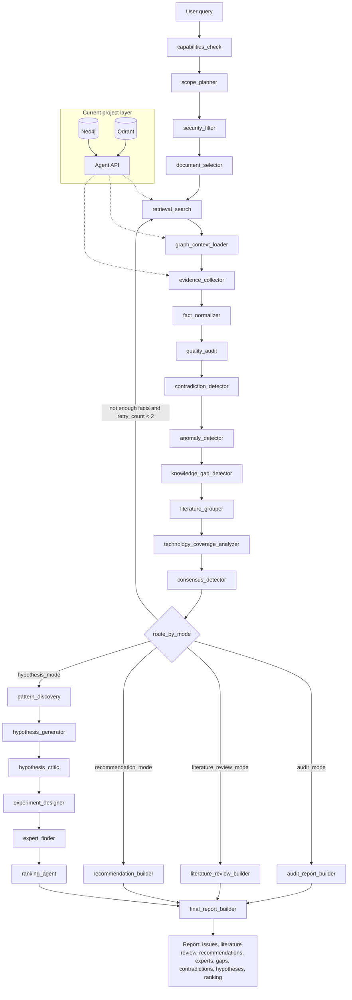

# Архитектура мультиагентной системы

## Контекст

Текущий проект уже решает базовую инфраструктурную часть:
- принимает документы;
- выполняет OCR/Markdown-подготовку;
- извлекает L1-L6 сущности и связи;
- сохраняет результат в Neo4j;
- индексирует L3/L4 в Qdrant;
- отдаёт данные через Agent API.

На текущем этапе система в основном **строит и хранит карту знаний**. Она ещё не делает полноценный аналитический вывод: не генерирует исследовательские гипотезы, не оценивает их новизну, не ранжирует направления исследований и не выявляет системно неточности в извлечённых знаниях.

Поэтому мультиагентная архитектура должна быть не заменой текущего пайплайна, а **аналитическим слоем поверх сохранённого графа**.

## Цель мультиагентного слоя

Добавить поверх Neo4j + Qdrant два новых класса возможностей:

1. **Выявление неточностей и слабых мест графа**
   - противоречивые выводы между источниками;
   - числовые аномалии и нарушения диапазонов;
   - несовпадение единиц измерения;
   - факты без явного источника;
   - низкая confidence;
   - дубли сущностей;
   - неполные цепочки `материал -> процесс -> условие -> результат`;
   - плохо покрытые области знаний.

2. **Генерация исследовательских гипотез**
   - поиск повторяющихся успешных комбинаций параметров;
   - перенос решений из смежных процессов;
   - гипотезы на основе пробелов в знаниях;
   - гипотезы на основе противоречий;
   - рекомендации по новым экспериментам;
   - ранжирование гипотез по новизне, доказательной базе, реализуемости, экономике и экологии.

3. **Структурированные ответы и литературные обзоры**
   - группировка источников по методу, году, географии и уровню детализации;
   - выделение консенсусных выводов и зон разногласий;
   - указание степени уверенности и числа подтверждающих источников;
   - поиск технологий, описанных только в отечественной или только в зарубежной литературе.

4. **Рекомендательный контур**
   - похожие кейсы и потенциально применимые решения из смежных областей;
   - эксперты, команды и лаборатории, связанные с темой запроса;
   - смежные темы для углублённого изучения.

## Правильная роль LangGraph

LangGraph не должен повторно выполнять ingestion/extraction и не должен напрямую подменять worker.

Его роль:
- читать уже сохранённые данные через Agent API;
- выбирать релевантные подграфы;
- проверять качество фактов;
- находить закономерности, противоречия и пробелы;
- генерировать гипотезы;
- критиковать и ранжировать гипотезы;
- формировать объяснимый отчёт с источниками.

Текущие сервисы остаются нижним уровнем:

```text
Документы
  -> ingestion
  -> extraction L1-L6
  -> Neo4j + Qdrant
  -> Agent API
  -> LangGraph analytics
  -> отчёт: неточности, пробелы, гипотезы, рекомендации
```

---

## Уровни агентной системы

## 1. Технические агенты текущего проекта

Эти роли уже частично или полностью отражены в `GET /api/v1/agents/capabilities`.

| Агент | Статус | Назначение |
|-------|--------|------------|
| `ingestion` | готов | Загрузка документа, OCR, Markdown, абзацы |
| `extraction` | готов | Извлечение L1-L6 сущностей, фактов и связей |
| `graph_fusion` | готов | Сохранение и чтение графа Neo4j |
| `retrieval` | готов | Поиск по L3/L4 через Qdrant и keyword fallback |
| `validation` | частично | Будущие проверки confidence, противоречий и аномалий |
| `synthesis` | план | Будущий аналитический отчёт |
| `security` | частично | Гриф доступа, роли, фильтрация источников |
| `notification` | частично | Логи пайплайна и будущие уведомления |

## 2. Аналитические агенты, которые нужно добавить

| Агент | Назначение | Используемые данные |
|-------|------------|---------------------|
| `Scope Planner Agent` | Определяет область анализа: документ, тема, материал, процесс, период, география | запрос пользователя, список документов |
| `Graph Context Agent` | Загружает релевантный подграф и соседей найденных узлов | Neo4j graph, Agent API |
| `Evidence Collector Agent` | Собирает доказательства для фактов: Claim, Measurement, TextParagraph, Document | L3/L4/L2 связи |
| `Fact Normalizer Agent` | Нормализует единицы измерения, диапазоны, годы, географию, названия материалов и процессов | L1/L2/L4 |
| `Quality Audit Agent` | Ищет технические проблемы графа: факты без источников, дубли, пустые связи, низкую confidence | все слои |
| `Contradiction Agent` | Находит противоречия между измерениями, claim и выводами разных источников | L4/L5/L2 |
| `Anomaly Agent` | Ищет числовые выбросы, нарушения норм и странные сочетания параметров | Measurement, StandardMetric, Qdrant |
| `Knowledge Gap Agent` | Находит непокрытые или слабо покрытые комбинации `материал-процесс-условие` | L1/L4/L6 |
| `Literature Review Agent` | Группирует источники по методу, году, географии и уровню детализации | Document, Timeline, Location, Claim |
| `Technology Coverage Agent` | Сравнивает отечественную и зарубежную литературу, ищет технологии только в одном корпусе | TechnologySolution, Document, Location |
| `Consensus Agent` | Выделяет консенсусные выводы и зоны разногласий | Claim, Measurement, Contradiction |
| `Pattern Discovery Agent` | Ищет повторяющиеся успешные схемы, параметры и связи | L1/L4/L6 + Qdrant |
| `Hypothesis Generator Agent` | Формирует гипотезы на основе паттернов, пробелов и противоречий | результаты аналитических агентов |
| `Hypothesis Critic Agent` | Проверяет гипотезы на новизну, доказательность, противоречия и слабые места | evidence, patents/publications later |
| `Experiment Design Agent` | Предлагает минимальные эксперименты для проверки гипотезы | L4/L6, constraints |
| `Recommendation Agent` | Ищет похожие кейсы, смежные решения и темы для изучения | Pattern, KnowledgeGap, TechnologySolution |
| `Expert Finder Agent` | Находит экспертов, команды и лаборатории, связанные с темой запроса | Expert, Organization, Facility, Document |
| `Ranking Agent` | Ранжирует гипотезы по ценности и реализуемости | hypothesis + critique |
| `Report Agent` | Формирует итоговый отчёт | все промежуточные результаты |

## Почему такая структура лучше подходит

Она учитывает, что текущая система уже умеет сохранять знания, но не умеет интерпретировать их исследовательски.

Ключевой сдвиг:
- раньше система заканчивала работу на `extraction -> graph load`;
- новая архитектура начинает работу после сохранения графа;
- главная ценность переносится в `audit -> pattern discovery -> hypothesis generation -> critique -> ranking`.

---

## Типы неточностей, которые должен искать LangGraph

| Тип проблемы | Пример | Что создавать в графе |
|--------------|--------|-----------------------|
| Нет источника | Claim есть, но нет связи с TextParagraph или Document | `VerificationStatus`, `AuditTrail` |
| Низкая уверенность | `confidence < threshold` | обновление confidence, audit event |
| Дубли сущностей | `электроэкстракция`, `electrowinning`, `ЭЭ` как разные Process | кандидат в `SynonymMap` |
| Несовместимые единицы | мг/л сравнивается с г/м3 без конвертации | `Contradiction` или `AuditTrail` |
| Противоречивые значения | один источник даёт 200 мг/л, другой 800 мг/л при похожих условиях | `Contradiction` |
| Нарушение нормы | концентрация выше допустимого диапазона | `EVALUATED_AGAINST`, `FOUND_ANOMALY` |
| Неполный факт | есть результат, но нет температуры/материала/процесса | `KnowledgeGap` |
| Географическая неоднозначность | "мировая практика" без страны/региона | `KnowledgeGap` |
| Неопределённый корпус литературы | технология встречается только в РФ/только за рубежом, но это не отражено | `KnowledgeGap`, аналитическая метка coverage |
| Устаревший источник | старый факт конфликтует с новым | снижение confidence |

## Типы гипотез

| Тип гипотезы | Основание |
|--------------|-----------|
| Параметрическая | похожие эксперименты дают лучший результат при определённом диапазоне параметров |
| Технологическая | метод из одного процесса может быть применим к соседнему процессу |
| Материальная | материал/реагент из одного домена может заменить другой |
| Экологическая | технология снижает негативный показатель, но требует проверки экономики |
| Экономическая | решение потенциально выгодно из-за меньших CAPEX/OPEX |
| Пробельная | данных мало, но комбинация важна для производства |
| Противоречивая | разные источники расходятся, нужен проверочный эксперимент |
| Трансферная | похожее решение найдено в смежной области и может быть адаптировано |

---

## Конкретный pipeline LangGraph

LangGraph должен поддерживать два режима:

1. `audit_mode` - найти неточности, противоречия и слабые места графа.
2. `hypothesis_mode` - сгенерировать и отранжировать исследовательские гипотезы.

Оба режима используют один state и общий начальный pipeline.

### State

```python
class MKGState(TypedDict, total=False):
    user_query: str
    mode: Literal["audit_mode", "hypothesis_mode", "literature_review_mode", "recommendation_mode"]
    user_role: str

    scope: dict
    candidate_doc_ids: list[str]
    allowed_doc_ids: list[str]

    search_hits: list[dict]
    graph_context: list[dict]
    facts: list[dict]
    normalized_facts: list[dict]
    evidence: list[dict]

    quality_issues: list[dict]
    contradictions: list[dict]
    anomalies: list[dict]
    knowledge_gaps: list[dict]
    source_groups: list[dict]
    technology_coverage: list[dict]
    consensus_points: list[dict]
    disagreement_zones: list[dict]
    patterns: list[dict]

    hypotheses: list[dict]
    critiques: list[dict]
    experiment_suggestions: list[dict]
    recommendations: list[dict]
    related_experts: list[dict]
    ranked_hypotheses: list[dict]

    final_report: str
    retry_count: int
    errors: list[str]
```

### Узлы графа

| Шаг | Node | Назначение | Основные API |
|-----|------|------------|--------------|
| 1 | `capabilities_check` | Проверить доступные агенты и ограничения MVP | `GET /agents/capabilities` |
| 2 | `scope_planner` | Разобрать запрос: тема, материал, процесс, география, период, режим | LLM structured output |
| 3 | `security_filter` | Отсечь документы вне роли пользователя | metadata, L5 |
| 4 | `document_selector` | Найти документы-кандидаты | `GET /agents/docs` |
| 5 | `retrieval_search` | Найти релевантные абзацы и claims | `POST /documents/{id}/search` |
| 6 | `graph_context_loader` | Раскрыть соседей найденных узлов | `GET /nodes/{node_id}`, `GET /relationships` |
| 7 | `evidence_collector` | Собрать факты и источники | L2/L3/L4 links |
| 8 | `fact_normalizer` | Привести единицы, диапазоны, названия и даты к единому виду | rules + LLM |
| 9 | `quality_audit` | Найти проблемы качества графа | graph_context, normalized_facts |
| 10 | `contradiction_detector` | Найти конфликтующие факты | normalized_facts |
| 11 | `anomaly_detector` | Найти выбросы и нарушения норм | Measurement, StandardMetric |
| 12 | `knowledge_gap_detector` | Найти неполные или отсутствующие комбинации | L1/L4/L6 |
| 13 | `literature_grouper` | Сгруппировать источники по методу, году, географии, детализации | Document, Timeline, Location |
| 14 | `technology_coverage_analyzer` | Найти технологии только в отечественной или только в зарубежной литературе | TechnologySolution, Document |
| 15 | `consensus_detector` | Выделить консенсусные выводы и зоны разногласий | Claim, Measurement, Contradiction |
| 16 | `route_by_mode` | Выбрать ветку audit, review, recommendation или hypothesis | state.mode |
| 17a | `audit_report_builder` | Собрать отчёт о неточностях | issues, contradictions, gaps |
| 17b | `literature_review_builder` | Собрать структурированный литературный обзор | source_groups, consensus |
| 17c | `recommendation_builder` | Собрать похожие кейсы, смежные решения, темы, экспертов | patterns, experts, gaps |
| 17d | `pattern_discovery` | Найти закономерности и повторяемые связи | facts, graph_context, Qdrant |
| 18d | `hypothesis_generator` | Сформировать гипотезы | patterns, gaps, contradictions |
| 19d | `hypothesis_critic` | Проверить гипотезы на доказательность и слабые места | evidence, graph |
| 20d | `experiment_designer` | Предложить эксперименты для проверки | hypotheses, constraints |
| 21d | `expert_finder` | Найти экспертов, команды и лаборатории по теме | Expert, Organization, Facility |
| 22d | `ranking_agent` | Отранжировать гипотезы и рекомендации | critique, feasibility, novelty |
| 23 | `final_report_builder` | Сформировать итоговый Markdown/JSON отчёт | all results |

### Edges

```python
graph = StateGraph(MKGState)

graph.add_node("capabilities_check", capabilities_check)
graph.add_node("scope_planner", scope_planner)
graph.add_node("security_filter", security_filter)
graph.add_node("document_selector", document_selector)
graph.add_node("retrieval_search", retrieval_search)
graph.add_node("graph_context_loader", graph_context_loader)
graph.add_node("evidence_collector", evidence_collector)
graph.add_node("fact_normalizer", fact_normalizer)
graph.add_node("quality_audit", quality_audit)
graph.add_node("contradiction_detector", contradiction_detector)
graph.add_node("anomaly_detector", anomaly_detector)
graph.add_node("knowledge_gap_detector", knowledge_gap_detector)
graph.add_node("literature_grouper", literature_grouper)
graph.add_node("technology_coverage_analyzer", technology_coverage_analyzer)
graph.add_node("consensus_detector", consensus_detector)
graph.add_node("audit_report_builder", audit_report_builder)
graph.add_node("literature_review_builder", literature_review_builder)
graph.add_node("recommendation_builder", recommendation_builder)
graph.add_node("pattern_discovery", pattern_discovery)
graph.add_node("hypothesis_generator", hypothesis_generator)
graph.add_node("hypothesis_critic", hypothesis_critic)
graph.add_node("experiment_designer", experiment_designer)
graph.add_node("expert_finder", expert_finder)
graph.add_node("ranking_agent", ranking_agent)
graph.add_node("final_report_builder", final_report_builder)

graph.set_entry_point("capabilities_check")

graph.add_edge("capabilities_check", "scope_planner")
graph.add_edge("scope_planner", "security_filter")
graph.add_edge("security_filter", "document_selector")
graph.add_edge("document_selector", "retrieval_search")
graph.add_edge("retrieval_search", "graph_context_loader")
graph.add_edge("graph_context_loader", "evidence_collector")
graph.add_edge("evidence_collector", "fact_normalizer")
graph.add_edge("fact_normalizer", "quality_audit")
graph.add_edge("quality_audit", "contradiction_detector")
graph.add_edge("contradiction_detector", "anomaly_detector")
graph.add_edge("anomaly_detector", "knowledge_gap_detector")
graph.add_edge("knowledge_gap_detector", "literature_grouper")
graph.add_edge("literature_grouper", "technology_coverage_analyzer")
graph.add_edge("technology_coverage_analyzer", "consensus_detector")

graph.add_conditional_edges(
    "consensus_detector",
    route_by_mode,
    {
        "audit": "audit_report_builder",
        "literature_review": "literature_review_builder",
        "recommendation": "recommendation_builder",
        "hypothesis": "pattern_discovery",
        "retry": "retrieval_search",
    },
)

graph.add_edge("audit_report_builder", "final_report_builder")
graph.add_edge("literature_review_builder", "final_report_builder")
graph.add_edge("recommendation_builder", "final_report_builder")

graph.add_edge("pattern_discovery", "hypothesis_generator")
graph.add_edge("hypothesis_generator", "hypothesis_critic")
graph.add_edge("hypothesis_critic", "experiment_designer")
graph.add_edge("experiment_designer", "expert_finder")
graph.add_edge("expert_finder", "ranking_agent")
graph.add_edge("ranking_agent", "final_report_builder")

graph.set_finish_point("final_report_builder")
```

### Routing

```python
def route_by_mode(state: MKGState) -> str:
    if not state.get("facts") and state.get("retry_count", 0) < 2:
        return "retry"
    if state.get("mode") == "audit_mode":
        return "audit"
    if state.get("mode") == "literature_review_mode":
        return "literature_review"
    if state.get("mode") == "recommendation_mode":
        return "recommendation"
    return "hypothesis"
```

## Audit mode: ожидаемый результат

`audit_mode` должен возвращать:
- список найденных неточностей;
- тип проблемы;
- affected `doc_id`, `node_id`, `relationship_id`;
- доказательство из текста или графа;
- уровень серьёзности;
- предлагаемое исправление;
- можно ли исправить автоматически.

Пример структуры:

```json
{
  "issue_type": "missing_source",
  "severity": "high",
  "node_id": "claim:optimal_flow_rate",
  "description": "Claim не связан с TextParagraph через SOURCE/DATA_SOURCE_FOR",
  "suggested_action": "переизвлечь документ или вручную привязать источник",
  "auto_fixable": false
}
```

## Hypothesis mode: ожидаемый результат

`hypothesis_mode` должен возвращать:
- гипотезу;
- на каких фактах она основана;
- какие источники её поддерживают;
- какие источники ей противоречат;
- что в ней новое;
- какие данные отсутствуют;
- как проверить гипотезу экспериментом;
- оценку реализуемости;
- экономические и экологические факторы;
- итоговый рейтинг.

Пример структуры:

```json
{
  "hypothesis": "Повышение эффективности электроэкстракции никеля возможно при ...",
  "basis": ["pattern:flow_rate_cluster", "gap:cold_climate_data"],
  "supporting_evidence": ["claim:...", "measurement:..."],
  "contradictions": ["contradiction:..."],
  "novelty": "medium",
  "feasibility": "high",
  "confidence": 0.62,
  "next_experiments": [
    {
      "goal": "проверить диапазон скорости потока",
      "variables": ["flow_rate", "temperature", "electrolyte_composition"],
      "expected_result": "уточнение оптимального диапазона"
    }
  ]
}
```

## Literature review mode: ожидаемый результат

`literature_review_mode` должен возвращать:
- источники, сгруппированные по методу, году, географии и уровню детализации;
- технологии, описанные только в отечественной литературе;
- технологии, описанные только в зарубежной литературе;
- технологии, встречающиеся в обоих корпусах;
- консенсусные выводы;
- зоны разногласий;
- степень уверенности по каждому выводу;
- количество подтверждающих источников.

Пример структуры:

```json
{
  "source_groups": [
    {
      "method": "bioleaching",
      "geography": "foreign",
      "years": "2018-2024",
      "detail_level": "experimental",
      "source_count": 12
    }
  ],
  "domestic_only_technologies": ["tech:..."],
  "foreign_only_technologies": ["tech:..."],
  "consensus_points": [
    {
      "claim": "метод устойчиво показывает рост извлечения при ...",
      "supporting_sources": 7,
      "confidence": 0.74
    }
  ],
  "disagreement_zones": [
    {
      "topic": "оптимальная температура процесса",
      "positions": ["45-55 C", "60-70 C"],
      "source_count": 5
    }
  ]
}
```

## Recommendation mode: ожидаемый результат

`recommendation_mode` должен возвращать:
- похожие кейсы;
- потенциально применимые решения из смежных областей;
- экспертов и команды, которые работали с аналогичными задачами;
- связанные лаборатории и организации;
- смежные темы для углублённого изучения;
- объяснение, почему рекомендация связана с исходным запросом.

Пример структуры:

```json
{
  "similar_cases": ["case:..."],
  "adjacent_solutions": [
    {
      "solution": "tech:membrane_separation",
      "source_domain": "water_treatment",
      "target_domain": "nickel_processing",
      "reason": "похожий профиль загрязнений и близкие требования к селективности"
    }
  ],
  "related_experts": ["expert:...", "team:..."],
  "related_labs": ["organization:...", "facility:..."],
  "deep_dive_topics": ["селективные сорбенты", "мембранное разделение", "низкотемпературное выщелачивание"]
}
```

## Приоритет внедрения

1. **Audit mode MVP**
   - факты без источников;
   - низкая confidence;
   - дубли сущностей;
   - неполные цепочки;
   - простые числовые противоречия.

2. **Contradiction + KnowledgeGap**
   - создание `Contradiction` и `KnowledgeGap` в Neo4j;
   - связь с исходными Claim/Measurement/TextParagraph.

3. **Pattern Discovery**
   - группировка похожих Claim/Measurement;
   - поиск устойчивых комбинаций параметров;
   - Qdrant-кластеры для похожих фрагментов.

4. **Hypothesis Generator**
   - генерация 3-10 гипотез по теме;
   - обязательное указание источников и пробелов.

5. **Critic + Ranking**
   - отсев слабых гипотез;
   - оценка новизны, доказательной базы, применимости, экономики и экологии.

Такой вариант лучше соответствует текущему состоянию проекта: база знаний уже строится, а агентный слой становится следующим этапом, который превращает сохранённый граф в инструмент поиска неточностей и генерации исследовательских гипотез.

## Mermaid graph pipeline


