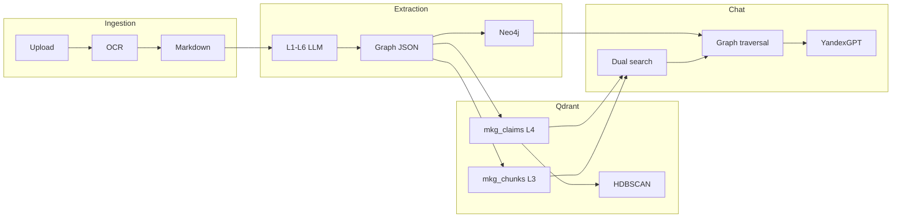

# Пайплайн документов и слои L1–L6

> L3 = семантический поиск (Qdrant). L4 = HDBSCAN-кластеры и аномалии.

UI cache: `?v=95` (при странном поведении — **Ctrl+F5**).

## Полный пайплайн (`processing_mode=full`)

```
Upload → OCR → Markdown (clean + marked) → Extraction L1–L6 → Graph JSON
  → Neo4j MERGE → Qdrant (mkg_chunks + mkg_claims) → L4 HDBSCAN
```

| Этап | UI (вкладка «Пайплайн») | API retry | Worker / код |
|------|-------------------------|-----------|----------------|
| Загрузка | Файл | — | `POST /api/v1/documents` |
| OCR / ingestion | OCR | ↺ OCR | `run_ingestion`, `mkg_ingestion.process` |
| Markdown | MD | ↺ OCR | clean + marked `.md` в storage |
| Extraction L1–L6 | Граф | ↺ Извлечение | `run_extraction`, `extractor.py` |
| Neo4j | Neo4j | ↺ Neo4j | `load_graph`, `POST .../neo4j-sync` |
| Qdrant | Qdrant | ↺ Индекс | `index_document_graph`, `POST .../index` |
| L4 HDBSCAN | L4 | ↺ HDBSCAN L4 | `apply_document_l4_cluster`, `POST .../l4-cluster` |

При `AUTO_EXTRACT_AFTER_INGEST=true` (по умолчанию) worker после ingestion сам ставит extraction; после успешного extraction — автоиндексация Qdrant и L4-кластеризация (если не `answers_only`).

## Лёгкий путь (`processing_mode=answers_only`)

```
Upload → OCR → Markdown → Qdrant (только mkg_chunks из MD)
```

- Extraction, Neo4j, L4 **пропускаются**.
- Используется для быстрой загрузки файла «только для ответов в чате».
- Выбор режима: модальное окно при прикреплении файла в **Чат** (кнопка прикрепления) или параметр `processing_mode` при upload.
- **Upgrade в full:** кнопка «↺ Построить полный граф» / `POST /api/v1/documents/{id}/reprocess-full` — запускает extraction → Neo4j → Qdrant → L4 для уже загруженного `answers_only` документа.

## Граф «Все документы»

- В списке документов: пункт **«Все документы»** → объединённый vis-network корпуса (`graphScope=all`).
- Те же **расширенные фильтры**, L1–L6 chips, **Сравнение** Process/Material, expert edit на рёбрах.
- API: merge локальных JSON-графов на клиенте; Neo4j — per-doc sync.

## Шесть онтологических слоёв

| Слой | Содержание | Извлечение в MVP |
|------|------------|------------------|
| **L1** | Материалы, процессы, оборудование | LLM |
| **L2** | Технологические стадии, условия | LLM |
| **L3** | TextParagraph, HeadingContext, LangContext | Детерминированно из MD + bridge |
| **L4** | ExperimentRun, Measurement, Claim, Effect… | LLM |
| **L5** | SecurityRole, VerificationStatus, AuditTrail | Детерминированно |
| **L6** | Document, Author, Source, Publication | LLM + метаданные |

Межслойные связи L3: `_bridge_text_to_layers` → `CONTEXT_FOR`, `DATA_SOURCE_FOR`, `ABOUT`.

Статус слоёв в UI: `GET /api/v1/documents/{id}/pipeline/layers`.

## L3 vs L4: два разных контура

### L3 — embedding search (Qdrant `mkg_chunks`)

- Индексируются узлы `TextParagraph` (и chunk'и MD в режиме `answers_only`).
- Коллекция: **`mkg_chunks`** (256-dim, Yandex `text-search-doc` / `text-search-query`).
- Назначение: семантический поиск цитат и абзацев, RAG-контекст в чате.
- **Не** содержит меток кластера/аномалии.

### L4 — HDBSCAN clusters + anomalies (Qdrant `mkg_claims`)

- Индексируются L4-узлы: `Claim`, `Measurement`, `ExperimentRun`, `Effect` и др.
- Коллекция: **`mkg_claims`**.
- После индексации: **HDBSCAN** по векторам L4 → `cluster_id`, `is_anomaly`, `anomaly_score` в payload Qdrant и свойствах узлов графа (`l4_cluster`).
- Настройки: `HDBSCAN_MIN_CLUSTER_SIZE`, `HDBSCAN_MIN_SAMPLES` в `.env`.
- API: `POST /api/v1/graph/l4/cluster`, `GET /api/v1/graph/anomalies`, `POST /api/v1/documents/{id}/l4-cluster`.

## Dual search в чате

При запросе в режиме **Диалог** (`POST /api/v1/chat/complete`):

1. **Qdrant dual search** — `search_global()` ищет одновременно в `mkg_chunks` (L3) и `mkg_claims` (L4), объединяет hits по score.
2. **Graph traversal** — от seed-узлов hits обход Neo4j (или локального JSON) на `GRAPH_TRAVERSAL_MAX_HOPS` hops → подграф контекста.
3. **LLM** — ответ с блоком **Источники** (ссылки на Markdown документов).

Trace в ответе: `chat_role` → `qdrant_search` → `graph_traversal` → `llm_compose`.

## Qdrant — корпус (не per-doc по умолчанию)

- Вкладка **Qdrant** работает по **всему корпусу**: статистика **N / M документов** проиндексировано, точки L3+L4.
- **Семантический поиск** — `POST /agents/search` без обязательного `document_id`; chip-фильтры post-search на клиенте.
- **Карта L4-кластеров** — клик по кластеру → панель состава; аномалии — красные точки на карте.
- Per-doc индексация — из карточки документа или «Все документы» на вкладке Qdrant.

## Фильтрация (граф и Qdrant)

Расширенные фильтры графа и post-search chips Qdrant — см. [`25_functional_filters.md`](25_functional_filters.md).

Кратко:
- **Граф:** тип документа, тип связи, язык, география, практика RU/foreign, диапазон Measurement, синонимы material/process.
- **Qdrant:** doc type, слой L3/L4, min confidence (клиентские chip-фильтры).
- **Чат:** facet-фильтры из пресета графа — в roadmap.

## Neo4j

- Схема: `packages/graph/schema.cypher`.
- Загрузка: `load_graph()` после extraction; повтор — `POST /api/v1/documents/{id}/neo4j-sync`.
- Эмбеддинги **не** хранятся в Neo4j — только в Qdrant.

## Диаграмма хранилищ



## Связанные документы

- [`15_l3_qdrant_clustering.md`](15_l3_qdrant_clustering.md) — детали Qdrant и L3-узлов
- [`22_chat_agents.md`](22_chat_agents.md) — роли, AI-режимы, trace
- [`25_functional_filters.md`](25_functional_filters.md) — фильтры графа и Qdrant
- [`14_agent_api.md`](14_agent_api.md) — REST для интеграций
