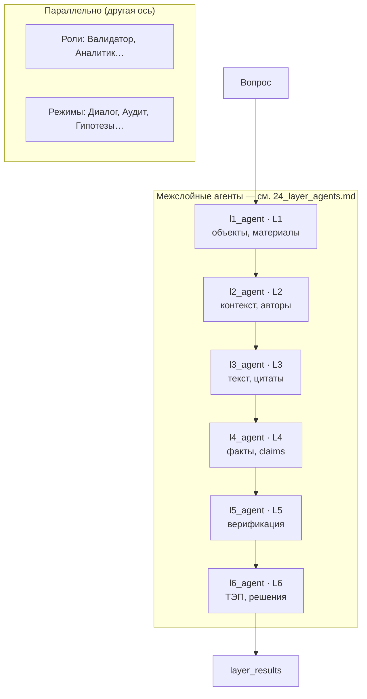
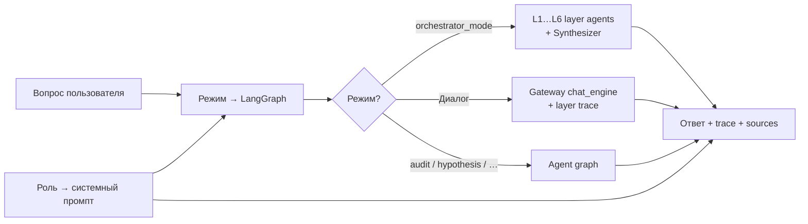

# Иерархия агентов MKG

> **Межслойные агенты L1–L6** (`l1_agent` … `l6_agent`) — каноническое описание в [`24_layer_agents.md`](24_layer_agents.md): углы слоёв, `situation_evaluation`, метки Neo4j, отличие от ролей.

UI cache: `?v=76` (при странном поведении — **Ctrl+F5**).

## Три оси: слой, роль, режим

MKG использует **иерархическую оркестрацию** по слоям графа (L1–L6) и **параллельно** — роли пользователя и AI-режимы. Последовательный **цикл L1→L6** с накоплением контекста — [`24_layer_agents.md`](24_layer_agents.md) (раздел «Цикл межслойных агентов»). Это разные измерения:

| Измерение | Что задаёт | Пример |
|-----------|------------|--------|
| **Слой (L1–L6)** | *Откуда* брать evidence в графе MKG | L4-агент ищет Claim и аномалии |
| **Роль пользователя** | *Как* формулировать ответ (стиль, права) | Валидатор → акцент на проверку |
| **AI-режим** | *Какой* LangGraph-граф запустить | Аудит, Гипотезы, Оркестратор |

Роль **не заменяет** layer agent: аналитик в режиме «Оркестратор» всё равно проходит L1→L6, но ответ звучит «аналитически».

## Межслойные агенты

Шесть агентов последовательно оценивают один вопрос — каждый через призму своего слоя онтологии MKG.

| Агент | Слой | Угол (кратко) |
|-------|------|---------------|
| `l1_agent` | L1 | Материалы, процессы, оборудование |
| `l2_agent` | L2 | Документы, эксперты, организации |
| `l3_agent` | L3 | Текстовые фрагменты, Qdrant L3 |
| `l4_agent` | L4 | Факты, claims, аномалии L4 |
| `l5_agent` | L5 | Верификация, противоречия |
| `l6_agent` | L6 | ТЭП, технологические решения |

Полная таблица, алгоритм `run_layer_agent`, метки Neo4j и trace-поля — [`24_layer_agents.md`](24_layer_agents.md).

## Оркестратор (координатор, не layer agent)

Оркестратор **не** является межслойным агентом. Он планирует обход, вызывает L1→L6, ищет связи и синтезирует ответ.

| Узел | Назначение |
|------|------------|
| `orchestrator_init` | Выбор документов |
| `orchestrator_plan` | LLM → `planned_layers`, `focus`, `keywords` |
| `layer_loop_start` | Маркер начала цикла L1→L6 |
| `l1_agent` … `l6_agent` | Вызов межслойных агентов (см. выше) |
| `discover_new_connections` | Cross-layer / cross-document пути |
| `connection_gap_analyzer` | Пробелы → повтор layer agents |
| `orchestrator_synthesize` | Финальный LLM-ответ |

Детали LangGraph-потока — раздел **Оркестратор L1–L6** в приложении. Код: `orchestrator_graph.py`, `layer_nodes.py`.

## Роли пользователя (параллельная ось)

Роли задают **стиль ответа и права**, не слой графа. Одна роль может работать с любым AI-режимом (если `can_run_agents`).

| Роль | Agent ID | Угол для пользователя | Типичный режим |
|------|----------|----------------------|----------------|
| `admin` | security | Администрирование, полный доступ | любой |
| `researcher` | synthesis | Гипотезы, обзоры, связи между фактами | Гипотезы, Оркестратор |
| `engineer` | ingestion | Пайплайн данных, без LangGraph-агентов | — |
| `analyst` | retrieval | Паттерны, Qdrant, граф | Диалог, Аномалии |
| `validator` | validation | Проверка фактов, severity | Аудит |
| `security` | security | RBAC, грифы L5 | — |
| `anomaly_hunter` | retrieval | L4-выбросы, HDBSCAN | Аномалии |
| `viewer` | notification | Только чтение | Диалог |

Подробнее: [`22_chat_agents.md`](22_chat_agents.md), **Роли vs агенты** (в приложении).

## AI-режимы (LangGraph)

Режим выбирает **граф обработки**, не слой. Только `orchestrator_mode` последовательно запускает L1–L6.

| Mode ID | UI | Угол задачи | Trace (кратко) | Когда использовать |
|---------|-----|-------------|----------------|-------------------|
| *(null)* | **Диалог** | Быстрый ответ по RAG | `qdrant_search` → `graph_traversal` → layer trace → `llm_compose` | Обычный вопрос |
| `orchestrator_mode` | **Оркестратор** | Полный обход слоёв + синтез | `layer_loop_start` → L1…L6 → discover → gap → synthesize | Сложный вопрос, все слои |
| `audit_mode` | **Аудит** | Противоречия, issue/severity | planner → retrieval → analyzer → `final_report` | Валидация фактов |
| `hypothesis_mode` | **Гипотезы** | Гипотезы и связи между claims | planner → hypothesis builder → critique | Исследовательский синтез |
| `anomaly_mode` | **Аномалии** | L4-выбросы HDBSCAN + соседи | anomaly walk → explain | Охота за outliers |
| `literature_review_mode` | **Обзор** | Структурированный обзор источников | grouped sources, consensus | Обзор литературы |
| `recommendation_mode` | **Советы** | Рекомендации, похожие кейсы | retrieval → recommendation builder | Практические советы |

> **`anomaly_mode`** — внутренний LangGraph-режим, **не** роль. Роль для аномалий — `anomaly_hunter`. См. [`24_layer_agents.md`](24_layer_agents.md).

API: `GET /api/v1/agents-service/modes`, `POST /api/v1/agents-service/run`.

## Как измерения складываются

**Пример:** роль `validator` + режим `audit_mode` → ответ с акцентом на противоречия, без обхода всех шести слоёв.

**Пример:** роль `researcher` + режим `orchestrator_mode` → полный L1→L6, ответ в исследовательском стиле.

## Связанные разделы

| Документ | Содержание |
|----------|------------|
| [`24_layer_agents.md`](24_layer_agents.md) | Межслойные агенты: каноническое описание, диаграммы |
| [`22_chat_agents.md`](22_chat_agents.md) | Чат, роли, режимы, trace, upload |
| [`21_pipeline_and_layers.md`](21_pipeline_and_layers.md) | Пайплайн ingestion L1–L6 |
| Оркестратор (в приложении) | LangGraph-поток: init → plan → **цикл L1…L6** → discover → gap → synthesize |
| Роли vs агенты (в приложении) | Схема UI → gateway → agents |
