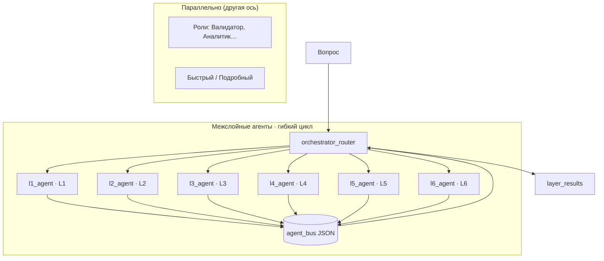
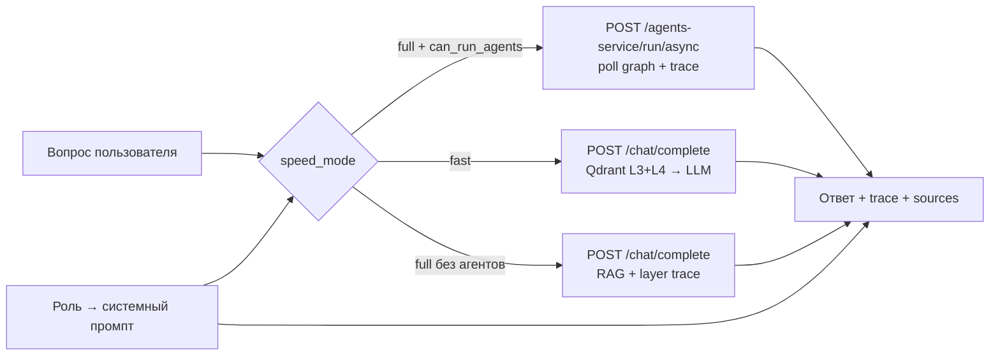

# Иерархия агентов MKG

> **Межслойные агенты L1–L6** (`l1_agent` … `l6_agent`) — каноническое описание в [`24_layer_agents.md`](24_layer_agents.md): гибкий цикл, JSON-шина, `situation_evaluation`, отличие от ролей.

UI cache: `?v=137` (при странном поведении — **Ctrl+F5**).

## Три оси: слой, роль, скорость

MKG использует **оркестрацию по слоям графа (L1–L6)** и **параллельно** — роли пользователя и режим скорости ответа. AI-режимы LangGraph **не выбираются в UI чата** — только через API.

| Измерение | Что задаёт | Пример |
|-----------|------------|--------|
| **Слой (L1–L6)** | *Откуда* брать evidence в графе MKG | L4-агент ищет Claim и аномалии |
| **Роль пользователя** | *Как* формулировать ответ (стиль, права) | Валидатор → акцент на проверку |
| **Скорость (`speed_mode`)** | *Быстрый* RAG или *Подробный* оркестратор | `fast` / `full` в `/chat/complete` |
| **AI-режим (API)** | *Какой* LangGraph-граф запустить | Аудит, Гипотезы, Оркестратор |

Роль **не заменяет** layer agent: аналитик в режиме «Подробный» получает evidence через гибкий цикл L1–L6, но ответ звучит «аналитически».

## Межслойные агенты

Шесть агентов оценивают один вопрос — каждый через призму своего слоя. В оркестраторе порядок **не фиксирован L1→L6**: маршрутизатор выбирает следующий слой по плану, пробелам и сообщениям **JSON-шины** (см. [`24_layer_agents.md`](24_layer_agents.md)).

| Агент | Слой | Угол (кратко) |
|-------|------|---------------|
| `l1_agent` | L1 | Материалы, процессы, оборудование |
| `l2_agent` | L2 | Документы, эксперты, организации |
| `l3_agent` | L3 | Текстовые фрагменты, Qdrant L3 |
| `l4_agent` | L4 | Факты, claims, аномалии L4 |
| `l5_agent` | L5 | Верификация, противоречия |
| `l6_agent` | L6 | ТЭП, технологические решения |

Полная таблица, алгоритм `run_layer_agent`, метки Neo4j и trace-поля — [`24_layer_agents.md`](24_layer_agents.md).

## Оркестратор (координатор, не layer agent)

Оркестратор **не** является межслойным агентом. Он планирует обход, запускает **гибкий цикл** layer agents, ищет связи и синтезирует ответ.

| Узел | Назначение |
|------|------------|
| `orchestrator_init` | Выбор документов, инициализация `agent_bus` |
| `orchestrator_plan` | LLM → `planned_layers`, `priority_layers`, `query_facets` |
| `agent_loop_start` | `round=0`, `max_rounds=AGENT_LOOP_MAX_ROUNDS` |
| `orchestrator_router` | Выбор следующего `l*_agent` или выход из цикла |
| `l1_agent` … `l6_agent` | Вызов межслойных агентов (читают/пишут шину) |
| `discover_new_connections` | Cross-layer / cross-document пути |
| `connection_gap_analyzer` | Пробелы → `gap_found` в шину или synthesize |
| `orchestrator_synthesize` | Финальный LLM-ответ |

Детали LangGraph-потока — раздел **Оркестратор L1–L6** в приложении. Код: `orchestrator_graph.py`, `layer_nodes.py`, `agent_bus.py`.

## Роли пользователя (параллельная ось)

Роли задают **стиль ответа и права**, не слой графа.

| Роль | Agent ID | Угол для пользователя | Чат (Подробный) |
|------|----------|----------------------|-----------------|
| `admin` | security | Администрирование, полный доступ | оркестратор |
| `researcher` | synthesis | Гипотезы, обзоры, связи между фактами | оркестратор |
| `engineer` | ingestion | Пайплайн данных, без LangGraph-агентов | RAG-fallback |
| `analyst` | retrieval | Паттерны, Qdrant, граф | оркестратор |
| `validator` | validation | Проверка фактов, severity | оркестратор |
| `security` | security | RBAC, грифы L5 | RAG-fallback |
| `anomaly_hunter` | retrieval | L4-выбросы, HDBSCAN (стиль ответа) | оркестратор |
| `viewer` | notification | Только чтение | RAG-fallback |

Подробнее: [`22_chat_agents.md`](22_chat_agents.md), **Роли vs агенты** (в приложении).

## AI-режимы (LangGraph, только API)

Режим выбирает **граф обработки**, не слой. В UI чата **нет** pill-переключателя режимов.

| Mode ID | Назначение | Trace (кратко) |
|---------|------------|----------------|
| `orchestrator_mode` | Гибкий цикл L1–L6 + шина + синтез | `agent_loop_start` → router ↔ agents → discover → gap → synthesize |
| `audit_mode` | Противоречия, issue/severity | planner → retrieval → analyzer → `final_report` |
| `hypothesis_mode` | Гипотезы и связи между claims | planner → hypothesis builder → critique |
| `anomaly_mode` | L4-выбросы HDBSCAN + соседи | anomaly walk → explain |
| `literature_review_mode` | Структурированный обзор источников | grouped sources, consensus |
| `recommendation_mode` | Рекомендации, похожие кейсы | retrieval → recommendation builder |

> **`anomaly_mode`** — внутренний LangGraph-режим, **не** роль. Роль для аномалий — `anomaly_hunter`.

API: `GET /api/v1/agents-service/modes`, `POST /api/v1/agents-service/run`, `POST /api/v1/agents-service/run/async`.

## Как измерения складываются в чате

**Пример:** роль `validator`, **Подробный** → оркестратор с акцентом на проверку в системном промпте.

**Пример:** роль `engineer`, **Подробный** → без оркестратора, RAG-диалог с layer trace.

## Безопасность (MVP)

- Развёртывание по умолчанию: `http://localhost:8000`, без серверной аутентификации.
- Роль пользователя — **клиентский выбор** (localStorage + `POST /users/session`), не RBAC на API.
- Очистка базы и expert edit — доверительная модель dev/demo; production требует auth и audit.

## Связанные разделы

| Документ | Содержание |
|----------|------------|
| [`24_layer_agents.md`](24_layer_agents.md) | Гибкий цикл, JSON-шина, `AGENT_LOOP_MAX_ROUNDS` |
| [`22_chat_agents.md`](22_chat_agents.md) | Чат, async graph, trace, upload |
| [`21_pipeline_and_layers.md`](21_pipeline_and_layers.md) | Пайплайн ingestion L1–L6 |
| Оркестратор (в приложении) | LangGraph: init → plan → **гибкий цикл** → discover → gap → synthesize |
| Роли vs агенты (в приложении) | Схема UI → gateway → agents |
