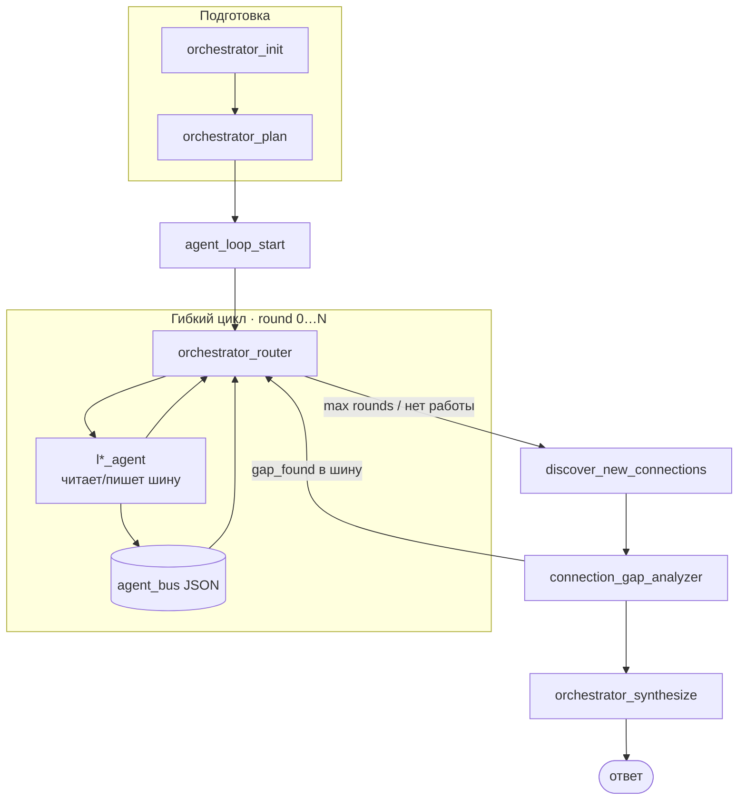

# Межслойные агенты (L1–L6)

> **Межслойный агент** — узел LangGraph, который оценивает вопрос пользователя **с точки зрения одного онтологического слоя** MKG (L1–L6). Это **не** роль пользователя (Валидатор, Аналитик и т.д.) и **не** отдельный AI-режим в UI.

UI cache: `?v=95` (при странном поведении — **Ctrl+F5**).

## Гибкий цикл агентов (шина JSON)

Оркестратор **не** выполняет жёсткий проход L1→L2→…→L6. Агенты работают в **раундах** (до `AGENT_LOOP_MAX_ROUNDS`, по умолчанию 4): маршрутизатор выбирает следующий слой по состоянию, пробелам и сообщениям **шины агентов**.



### JSON-шина (`agent_bus`)

In-process список сообщений в состоянии LangGraph. Код: `services/agents/app/agent_bus.py`.

**Схема сообщения:**

```json
{
  "id": "a1b2c3d4",
  "from": "l4_agent",
  "to": "l3_agent",
  "type": "request_evidence",
  "payload": {
    "layer": "L3",
    "question": "Нужны цитаты для фактов L4",
    "gap": "Слой L4: найдено только 1 узл."
  },
  "round": 1,
  "in_reply_to": "optional-request-id"
}
```

| Поле | Тип | Описание |
|------|-----|----------|
| `from` | string | Отправитель: `l1_agent` … `l6_agent`, `connection_gap_analyzer`, `orchestrator` |
| `to` | string | Получатель: `l*_agent`, `broadcast`, `orchestrator` |
| `type` | string | `request_evidence`, `graph_expand`, `question`, `gap_found`, `evidence`, `response`, `graph_patch` |
| `payload` | object | `question`, `gap`, `layer`, `summary`, `node_count`, `nodes_preview`, … |
| `round` | int | Номер раунда (0-based) |
| `in_reply_to` | string? | ID запроса для ответов |

**Состояние оркестратора:**

| Поле | Описание |
|------|----------|
| `agent_bus` | `list[dict]` — все сообщения |
| `round` | Текущий раунд (0…) |
| `max_rounds` | Лимит (`AGENT_LOOP_MAX_ROUNDS`, default 4) |
| `layers_invoked` | Слои, уже вызванные в текущем раунде |
| `orchestrator_next` | Следующий узел (для conditional edge) |

### Алгоритм маршрутизации (`orchestrator_router`)

1. **Pending bus** — необработанные `request_evidence` / `gap_found` → маршрут на `to`.
2. **Невызванные слои** из `planned_layers` — порядок гибкий: `priority_layers` из плана, затем слои с меньшим `node_count`.
3. **Конец раунда** — все planned вызваны → `round++`, сброс `layers_invoked` (если `round < max_rounds` и есть слабые слои).
4. **Завершение цикла** → `discover_new_connections` → `connection_gap_analyzer`.
5. Gap analyzer публикует `gap_found` в шину и возвращает в router, либо идёт в `orchestrator_synthesize`.

LLM-роутер (`_ROUTER_PROMPT`) уточняет эвристику при наличии времени; при таймауте — только эвристика.

### Расширение графа через шину

1. Агент находит пробел (`node_count < 2`) → `request_evidence` на комплементарный слой (L1→L3, L3→L4, …).
2. Целевой агент читает шину, уточняет `search_query`, собирает Neo4j/Qdrant evidence → `evidence` в ответ.
3. Узлы merge в `accumulated_graph`; при `graph_expand` (≥3 узла) — broadcast для соседних агентов.
4. `discover_new_connections` добавляет cross-layer пути после цикла.

### Где виден цикл

| Место | Что показывается |
|-------|------------------|
| Trace | `agent_loop_start`, `orchestrator_router`, `agent_loop_round`, `bus_messages` на шагах `l*_agent` |
| UI «Агенты · гибкий цикл» | Раунд N/M, чипы слоёв (не стрелка L1→L6), блок **Шина агентов** |
| Fallback-диалог | Облегчённый trace, `round: 0`, без шины |

Код: `orchestrator_graph.py`, `layer_nodes.py`, `agent_bus.py`, `chats.js`.

## Три оси системы (не смешивать)

| Ось | Что задаёт | Примеры | Где в коде |
|-----|------------|---------|------------|
| **Межслойные агенты L1–L6** | *Какой слой знаний* анализировать | `l3_agent` ищет TextParagraph в Qdrant | `layer_nodes.py` |
| **Роль пользователя** | *Стиль ответа* и права доступа | Валидатор → акцент на проверку фактов | `roles.py`, системный промпт |
| **AI-режим (LangGraph)** | *Какой граф* обработки запустить | Оркестратор, Аудит, Аномалии | `graph.py`, `orchestrator_graph.py` |

**Ключевое правило:** роль `analyst` **не заменяет** `l4_agent`. Роль меняет тон финального ответа; межслойный агент — источник evidence из конкретного слоя графа.

## Межслойные агенты — по одному на слой

| Агент | Слой | Вопрос агента | Источники данных |
|-------|------|---------------|------------------|
| `l1_agent` | **L1** | Материалы, процессы, оборудование | Neo4j L1 |
| `l2_agent` | **L2** | Кто и где упоминается | Neo4j L2 |
| `l3_agent` | **L3** | Текстовые фрагменты | Qdrant chunks, walk |
| `l4_agent` | **L4** | Факты, кластеры, аномалии | Qdrant claims, HDBSCAN |
| `l5_agent` | **L5** | Верификация, противоречия | Neo4j L5 |
| `l6_agent` | **L6** | ТЭП, экономика | Neo4j L6 |

### Алгоритм одного layer agent (`run_layer_agent`)

1. Читает входящие сообщения шины для своего `lN_agent`.
2. Поиск: Qdrant (L3/L4); keyword + walk Neo4j.
3. Merge в `accumulated_graph`; публикует ответы/`request_evidence`/`graph_expand` в шину.
4. Trace: `situation_evaluation`, `agent_question`, `round`, `bus_messages`.

## Конфигурация

```env
AGENT_LOOP_MAX_ROUNDS=4
```

Docker: `docker-compose.yml` → сервис `agents`. При недоступности оркестратора gateway fallback на RAG-диалог (`chat_engine.py`).

## API

```http
POST /api/v1/agents-service/run
{
  "query": "Какие материалы связаны с экспериментами?",
  "mode": "orchestrator_mode",
  "doc_ids": ["doc:abc123"],
  "user_role": "researcher"
}
```

Trace: `orchestrator_init` → `orchestrator_plan` → `agent_loop_start` → цикл `orchestrator_router` ↔ `l*_agent` → `discover` → `gap` → `synthesize`.

## Связанные разделы

| Документ | Содержание |
|----------|------------|
| [`22_chat_agents.md`](22_chat_agents.md) | Чат, trace, fallback |
| [`23_agent_hierarchy.md`](23_agent_hierarchy.md) | Три оси системы |
| Оркестратор (в приложении) | Узлы LangGraph |
