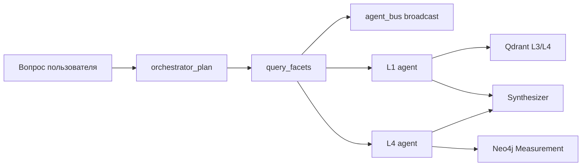

# Ключевые требования хакатона и их реализация в MKG

UI cache: `?v=95` (при странном поведении — **Ctrl+F5**).

## Обзор требований

| # | Требование | Статус MVP | Где в MKG |
|---|------------|------------|-----------|
| 1 | Сложные мультипараметрические запросы | **Реализовано** | `query_facets`, orchestrator planner, layer agents |
| 2 | Модель верификации знаний (источник, достоверность, дата) | **Реализовано** | `extraction_confidence`, блок «Источники» в чате |
| 3 | Географическая фильтрация RU / зарубежная | **Реализовано** | `query_facets.geography`, расширенные фильтры графа |
| 4 | Числовые ограничения (концентрация, температура, ТЭП) | **Частично** | Measurement numeric filter; L6 EconomicIndicator — roadmap |
| 5 | Масштабируемость на новые домены | **Документировано + онтология** | `ontology.py` DOMAIN_PROMPT_HINTS |

## 1. Мультипараметрические запросы

**Пример:** «Какие процессы выщелачивания меди применялись в России после 2015 при концентрации Cu > 1 г/л?»

### Поток данных

### Слои и агенты

| Фасет | Слой | Агент | Хранилище |
|-------|------|-------|-----------|
| material | L1 | l1_agent | Neo4j Material, Qdrant mkg_claims |
| process | L1 | l1_agent | Neo4j Process |
| geography (domestic/foreign) | L2 | l2_agent | Neo4j Location.country/region |
| year_min / year_max | L2 | l2_agent | Document.publication_year, Event.date |
| numeric_min/max, numeric_param | L4 | l4_agent | Measurement.numeric_value, parameter |
| conditions | L4 | l4_agent | Measurement.conditions, EnvironmentalCondition |
| TEP / экономика | L6 | l6_agent | EconomicIndicator (roadmap: numeric filter) |

### Код

- `packages/core/src/mkg_core/query_facets.py` — парсинг, обогащение поиска, пост-фильтрация хитов
- `services/agents/app/orchestrator_graph.py` — planner извлекает `query_facets`, публикует в `agent_bus`
- `services/agents/app/layer_nodes.py` — layer agents используют facets в Qdrant/граф-поиске
- `services/agents/app/state.py` — поле `query_facets` в OrchestratorState / MKGAgentState

## 2. Верификация знаний

| Поле | Источник | UI |
|------|----------|-----|
| Источник | `file_name`, `md_url` | Чипы «Источники · N» |
| Достоверность | `props.extraction_confidence` (0..1) | Badge: высокая ≥85%, средняя 70–84%, низкая <70% |
| Дата | `publication_year`, `updated_at`, `run_date` | Метка даты в chip |

Промпты: `role_prompts.py` CHAT_OUTPUT_RULES, synthesizer в `orchestrator_graph.py`.

## 3. Географическая фильтрация

### В чате (агенты)

`query_facets.geography`: `domestic` (RU), `foreign`, или конкретная страна/регион.
Фильтрация по `Location.country`, `region`, `city` и связанным узлам.

### В UI графа

Расширенные фильтры вкладки «Граф»:

- **География** — свободный выбор из Location-узлов корпуса
- **Практика** — `domestic` (российская) / `foreign` (зарубежная) по `Location.country` и эвристике RU-маркеров

## 4. Числовые диапазоны

### Реализовано (MVP)

- Фильтр графа: Measurement `numeric_value`, `concentration`, `temperature`, `flow_rate`
- Опциональный `numeric_param` (parameter name)
- `query_facets.numeric_min` / `numeric_max` в layer agents

### Roadmap

- Фильтр EconomicIndicator (L6) по TEP-метрикам
- Qdrant payload filter по numeric props при индексации
- Neo4j Cypher range queries для крупных корпусов

## 5. Масштабируемость доменов

`ontology.py`:

- `DOMAIN_PROMPT_HINTS` — гидрометаллургия, пирометаллургия, экология, отходы
- Расширение L1_LABELS + корпус документов без смены L2–L6

Новый домен = документы + extraction L1–L6 + Neo4j + Qdrant + (опционально) подсказки в planner.

## Связанные файлы

| Компонент | Файлы |
|-----------|-------|
| Core | `query_facets.py`, `ontology.py` |
| Agents | `orchestrator_graph.py`, `layer_nodes.py`, `nodes.py`, `state.py` |
| Gateway | `chat_engine.py`, `schemas.py`, `role_prompts.py` |
| UI | `app.js`, `chats.js`, `index.html`, `app.css` |
| Docs | этот файл, вкладка «Документация» → key-requirements |

См. также: [`22_chat_agents.md`](22_chat_agents.md), [`24_layer_agents.md`](24_layer_agents.md), [`21_pipeline_and_layers.md`](21_pipeline_and_layers.md).
