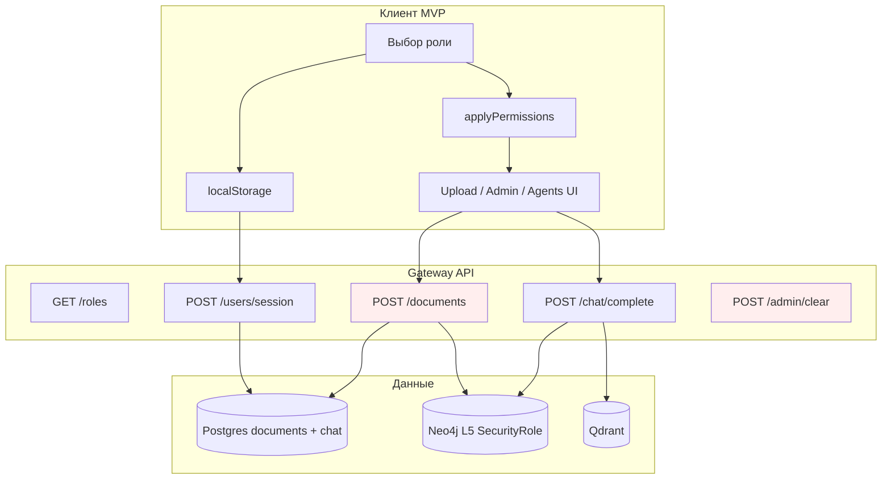

# Управление доступом и безопасность

UI cache: `?v=133` (при странном поведении — **Ctrl+F5**).

## Обзор: уровень реализации

MKG — **хакатонный MVP**. Управление доступом реализовано на **трёх уровнях**. **Фильтрация по грифу (`classification`) на чтении** добавлена в API (документы, поиск, граф, RAG), но **без криптографической аутентификации** — роль по-прежнему самодекларация клиента.

| Уровень | Что есть сейчас | Статус |
|---------|-----------------|--------|
| **UI / клиент** | Выбор роли, `applyPermissions()`, матрица «Доступ к данным», бейджи грифов, баннер «🔒 N скрыто» | ✅ Работает |
| **API gateway** | `X-MKG-Role` / `role_id`, фильтр `GET /documents`, `GET /graph/*`, `search_*`, `search_chat_retrieval`; PUT матрицы — admin | 🟡 MVP enforce |
| **Граф L5** | `SecurityRole`, `classification` документа при extraction | 🟡 Модель данных |
| **Production ИБ** | JWT/OAuth, TLS, audit всех API | ⬜ Roadmap |

> **Честно для жюри:** роль пользователя — **самодекларация** в браузере (`localStorage` + `POST /users/session`). Любой, кто знает URL gateway, может вызвать `POST /documents` или `POST /admin/clear` напрямую. Не выставляйте сервис в интернет без reverse proxy и auth (см. [`SECURITY.md`](../SECURITY.md) в корне репозитория).

### Соответствие слайду «Управление доступом»

На слайде хакатона перечислены роли: *исследователь, аналитик, руководитель проекта, администратор, внешний партнёр*. В коде MKG — **7 ролей** с другой детализацией (инженер, валидатор, безопасность, наблюдатель). Сопоставление:

| Роль на слайде | Роль MKG | Комментарий |
|----------------|----------|-------------|
| Исследователь | `researcher` | Загрузка, агенты, синтез |
| Аналитик | `analyst` | Поиск и граф, без загрузки |
| Руководитель проекта | *нет отдельной роли* | Дашборд `GET /dashboard/stats` доступен всем; активность чата — `collab_activity_stats()` |
| Администратор | `admin` | Полные права + очистка БД (UI) |
| Внешний партнёр | `viewer` (ближайший аналог) | Read-only: без upload и агентов |

Дополнительные роли MVP: `engineer` (пайплайн данных), `validator` (аудит фактов), `security` (промпт про L5/RBAC).

---

## Ролевая модель

**Источник истины:** `services/gateway/app/roles.py`  
**Промпты ролей:** `services/gateway/app/role_prompts.py`  
**API:** `GET /api/v1/roles`

### Таблица ролей и прав

| ID | Название (RU) | Agent ID | Upload | Extract* | Agents | Admin | Export** |
|----|---------------|----------|--------|----------|--------|-------|----------|
| `admin` | Администратор | security | ✅ | ✅ | ✅ | ✅ | ✅ |
| `researcher` | Исследователь | synthesis | ✅ | ✅ | ✅ | ❌ | ✅ |
| `engineer` | Инженер данных | ingestion | ✅ | ✅ | ❌ | ❌ | ✅ |
| `analyst` | Аналитик | retrieval | ❌ | ❌ | ✅ | ❌ | ✅ |
| `validator` | Валидатор | validation | ❌ | ❌ | ✅ | ❌ | ✅ |
| `security` | Безопасность | security | ❌ | ❌ | ❌ | ❌ | ✅ |
| `viewer` | Наблюдатель | notification | ❌ | ❌ | ❌ | ❌ | ✅ |

\* **`can_extract`** — поле в API-схеме (`RoleOut`), **не проверяется** ни в UI, ни на сервере при extraction (запуск пайплайна не привязан к сессии).

\** **Export** — кнопки экспорта (дашборд, граф, чат MD/JSON-LD) **не ограничены ролью** на сервере; ограничение только UX (скрытие upload/admin).

### Флаги прав (семантика)

| Флаг | Назначение |
|------|------------|
| `can_upload` | Загрузка документов (UI: панель upload, attach в чате) |
| `can_extract` | Задумано для запуска extraction — **MVP: декларативно** |
| `can_run_agents` | Режим «Подробный» → оркестратор L1–L6 (`chat_engine._try_orchestrator_chat`) |
| `can_admin` | Кнопка «Очистить базу» в UI (`clearDbBtn`) |

Прокси в agents service: `agents_user_role(role_id)` передаёт `user_role` в LangGraph (`POST /agents-service/run`).

---

## Разграничение доступа к чувствительным данным

### 1. UI (`chats.js` → `applyPermissions`)

При смене роли или восстановлении сессии:

```javascript
// services/gateway/app/static/js/chats.js — applyPermissions()
uploadPanel.classList.toggle("upload-hidden", !showUpload);
uploadBtn.disabled = !showUpload;
clearBtn.style.display = role.can_admin ? "" : "none";
homeRun.disabled = role.can_run_agents === false;
chatAttach.style.display = showUpload ? "" : "none";
```

Роли подгружаются с `GET /api/v1/roles`; при ошибке — fallback-массив в `chats.js`.

**Сессия:** `POST /api/v1/users/session` → Postgres `mkg_users` (id, display_name, role_id, last_seen_at). Клиент хранит сессию в `localStorage` (`mkg_user_session`).

### 2. Серверные проверки (единственные в MVP)

| Операция | Проверка роли |
|----------|---------------|
| `PATCH /graph/documents/{id}/relationship` | ✅ Только `admin`, `engineer` (`_GRAPH_EDIT_ROLES`) |
| `POST /documents`, `POST /admin/clear`, export endpoints | ❌ **Без проверки** |
| `POST /chat/complete`, `POST /query` | ❌ Принимает любой `role_id` из справочника |

### 3. Классификация документов (`classification`)

**Уровни грифа (по умолчанию):**

| Гриф | EN alias | Кто видит по умолчанию |
|------|----------|------------------------|
| `открытый` | public | все роли |
| `внутренний` | internal | все, кроме `viewer` |
| `конфиденциальный` | confidential | `admin`, `security` |
| `строго` | restricted | `admin`, `security` |

**Матрица role × classification** настраивается в UI: **Настройки → Доступ к данным** или через API `GET/PUT /api/v1/settings/data-access` (PUT — только `admin`). Хранится в Postgres `runtime_config.data_access_matrix` (JSON).

**Дефолты в `roles.py` (`allowed_classifications`):**

| Роль | Уровни |
|------|--------|
| `admin` | все (всегда, строка матрицы не редактируется) |
| `viewer` | `открытый` |
| `researcher`, `analyst`, `engineer`, `validator` | `открытый`, `внутренний` |
| `security` | все уровни (кроме admin-only wipe БД) |

**Enforcement (сервер, MVP — filter on read):**

| Endpoint | Фильтр |
|----------|--------|
| `GET /api/v1/documents` | только документы с допустимым грифом; поле `restricted_count` |
| `GET /api/v1/documents/{id}/*`, markdown, source | 403 если гриф выше допуска |
| `GET /api/v1/graph/documents/{id}`, `/graph/all` | узлы/рёбра только из доступных документов |
| `GET/POST /api/v1/search`, `/search/entities` | hits без недоступных `document_id` |
| `POST /chat/complete`, RAG | `search_chat_retrieval(..., allowed_classifications=…)` |

**Сессия:** клиент шлёт заголовок `X-MKG-Role` (из `localStorage` / `POST /users/session`). Без заголовка — роль `viewer` (минимальный доступ).

- При upload: поле `classification` (Form, по умолчанию `"открытый"`).
- Postgres `documents.classification`, JSON graph meta, L5 `SecurityRole.required_clearance`.

### 4. Слой L5 в графе знаний

При extraction (`mkg_extraction/extractor.py` → `_build_l5`) для каждого документа **детерминированно** создаются:

| Узел | Связь | Смысл |
|------|-------|-------|
| `SecurityRole` | `Document -[:GOVERNED_BY]-> SecurityRole` | `required_clearance` = classification документа |
| `VerificationStatus` | `VerificationStatus -[:WRITES_LOG]-> AuditTrail` | Уровень верификации (preliminary) |
| `AuditTrail` | — | `operation_type: extract`, `transaction_id` |

Онтология: `packages/core/src/mkg_core/ontology.py` — метки L5, тип `GOVERNED_BY`, props `SecurityRole.role_name`, `clearance_level`.

Роль **`security`** в чате получает системный промпт: *«Не раскрывай данные выше допустимого уровня роли»* — это **LLM-инструкция**, не enforce на уровне retrieval.



*Красным отмечены эндпоинты без серверной проверки роли.*

---

## Аудит действий

### Что логируется сегодня

| Источник | Что пишется | Где |
|----------|-------------|-----|
| **Чат** | Сообщения user/assistant, `author_role`, `meta` (trace, sources) | Postgres `chat_messages` |
| **Сессии** | `role_id`, `last_seen_at` | Postgres `mkg_users` |
| **Пайплайн LLM/OCR** | Вызовы embed/generate, doc_id, request/response (обрезка 4 KB) | `data/storage/logs/global.jsonl`, `{doc_id}.jsonl` |
| **L5 граф** | Узел `AuditTrail` на документ при extraction | Neo4j + JSON graph |
| **Expert graph edit** | `expert_comment`, `edited_by`, `edited_at` в props ребра + `graph.expert_edits[]` | JSON graph + Neo4j |
| **Очистка БД** | `log.info("database cleared …")` | stdout gateway |

### Дашборд активности (для «руководителя»)

`collab_db.collab_activity_stats()` → в `GET /api/v1/dashboard/stats`:

- число threads / messages;
- запросы за 7 дней;
- последние 5 диалогов.

**Не логируется отдельно:** факт экспорта CSV/JSON, просмотр документа, смена роли (кроме upsert user), неуспешные попытки доступа.

### Пробелы аудита (roadmap)

- Централизованный **audit log** таблицы Postgres (`audit_events`: user, action, resource, ip, ts).
- Корреляция export/download с сессией.
- Immutable log для compliance (WORM / SIEM).
- Полный жизненный цикл `Contradiction` / `KnowledgeGap` L5 (см. [`03_implementation_gap.md`](03_implementation_gap.md)).

---

## Соответствие политикам ИБ

### Документировано

| Документ | Содержание |
|----------|------------|
| [`SECURITY.md`](../SECURITY.md) | Responsible disclosure, рекомендации деплоя (не коммитить `.env`, сменить пароли БД, не выставлять без TLS/auth) |
| Этот файл | Ролевая модель, L5, ограничения MVP |
| [`22_chat_agents.md`](22_chat_agents.md) | Предупреждение: localhost, роль = клиентский выбор |
| [`19_user_guide.md`](19_user_guide.md) | То же для пользователя |

### Рекомендации для production

1. **Аутентификация:** OAuth2/OIDC или API key за reverse proxy (nginx, Traefik); привязка `role_id` к claims JWT, не к телу запроса.
2. **Авторизация:** middleware на все mutating routes (`upload`, `admin`, `graph` patch, export); матрица RBAC из `roles.py` на сервере.
3. **Classification enforcement:** фильтр Qdrant/Neo4j по `required_clearance` ≤ clearance пользователя; UI выбора грифа при upload.
4. **Сеть:** TLS, закрытые Neo4j/Qdrant/Postgres, secrets в vault.
5. **Аудит:** append-only `audit_events`, retention policy, экспорт для SOC.

Конфигурация достоверности (`confidence_weights`, `source_reliability_config`) в Postgres — отдельный аспект качества знаний, не RBAC.

---

## API, связанные с ролями и безопасностью

| Метод | Путь | Назначение | Auth MVP |
|-------|------|------------|----------|
| GET | `/api/v1/settings/data-access` | Матрица грифов (role × classification) | ❌ |
| PUT | `/api/v1/settings/data-access` | Сохранить матрицу | 🟡 admin (`X-MKG-Role`) |
| GET | `/api/v1/roles` | Список ролей, `allowed_classifications` | ❌ |
| GET | `/api/v1/roles/{id}/prompt` | Системный промпт роли | ❌ |
| PUT | `/api/v1/roles/{id}/prompt` | Кастомный промпт (Postgres `role_prompts`) | ❌ |
| DELETE | `/api/v1/roles/{id}/prompt` | Сброс к default | ❌ |
| POST | `/api/v1/users/session` | Upsert пользователя и роли | ❌ |
| GET | `/api/v1/users` | Список участников | ❌ |
| POST | `/api/v1/chat/complete` | Диалог с `role_id` | ❌ |
| POST | `/api/v1/query` | Программный запрос / agent modes | ❌ |
| POST | `/api/v1/documents` | Upload + `classification` | ❌ |
| POST | `/api/v1/admin/clear?confirm=true` | Очистка storage + Postgres + Neo4j | ❌ |
| PATCH | `/api/v1/graph/documents/{id}/relationship` | Expert comment | ✅ role in body |
| GET | `/api/v1/dashboard/stats` | KPI + team_activity | ❌ |
| GET | `/api/v1/dashboard/export/*.csv` | Экспорт обзора/рисков | ❌ |
| GET | `/api/v1/documents/{id}/logs` | JSONL лог пайплайна документа | ❌ |
| GET | `/api/v1/docs/access-and-security` | Этот документ в UI | ❌ |

Agents service (внутренний `:8010`): `user_role` в теле run — проксируется gateway, **не верифицируется**.

---

## Связанные материалы

- [`22_chat_agents.md`](22_chat_agents.md) — роли, чат, оркестратор
- [`21_pipeline_and_layers.md`](21_pipeline_and_layers.md) — слой L5
- [`27_additional_wishes.md`](27_additional_wishes.md) — export, dashboard
- [`03_implementation_gap.md`](03_implementation_gap.md) — gap RBAC / AuditTrail
- [`SECURITY.md`](../SECURITY.md) — политика безопасности репозитория
