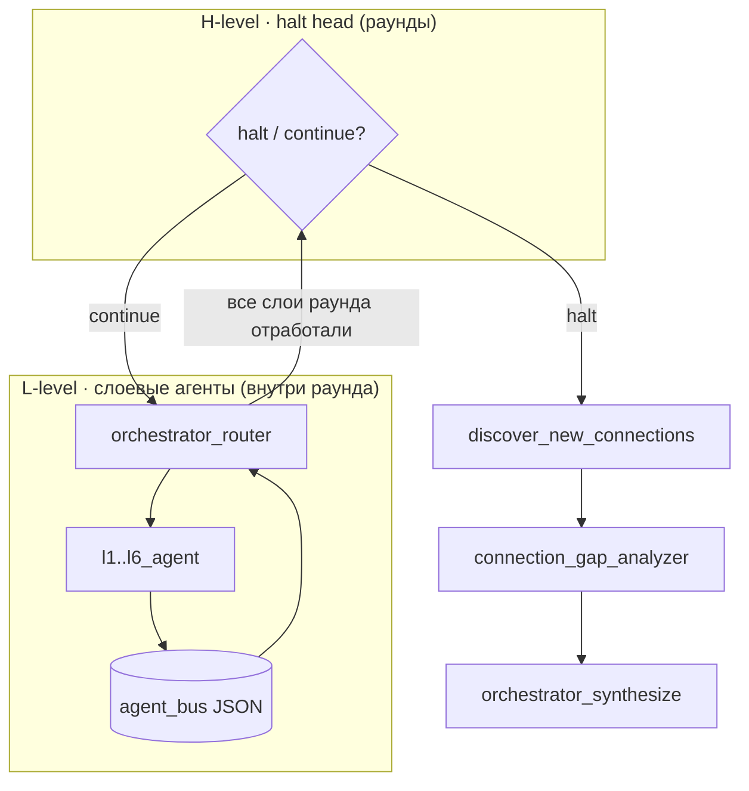
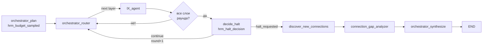

# HRM-адаптивное рассуждение оркестратора

UI cache: `?v=137` (при странном поведении — **Ctrl+F5**).

> Динамическое число раундов рассуждения вместо фиксированного счётчика. Высокоуровневый контроллер (halt head) сам решает **остановиться или продолжить**, опираясь на прирост знаний, незакрытые запросы шины и бюджет.

## Идея HRM (Hierarchical Reasoning Model)

HRM — двухуровневая схема рассуждения. В оркестраторе MKG она ложится на существующий гибкий цикл L1–L6:

- **Высокоуровневый контроллер (H-level)** — «halt head». После того как в раунде отработали все запланированные слои, он решает: собрано ли достаточно evidence, чтобы синтезировать ответ (`halt`), или нужен ещё один раунд исследования графа (`continue`).
- **Низкоуровневые агенты (L-level)** — слоевые агенты `l1_agent … l6_agent` внутри одного раунда. Они ищут узлы/связи, обмениваются сообщениями через JSON-шину (`agent_bus`) и накапливают подграф (`accumulated_graph`).



## Адаптивная остановка (ACT-подобная)

Вместо фиксированного числа циклов (`max_rounds = 4`) количество раундов **динамическое**, как в Adaptive Computation Time (ACT): модель тратит больше «шагов размышления» на сложные вопросы и меньше — на простые.

Сигналы остановки, которые учитывает halt head:

- **Marginal gain** — сколько новых `(узлы + связи)` добавил последний раунд. Если прирост ниже `AGENT_HALT_MIN_GAIN` — выгода от продолжения мала.
- **Pending bus** — незакрытые запросы между агентами (`get_pending_requests`). Если запросы есть, возможно, стоит дать ещё раунд.
- **Confidence** — уверенность LLM-«halt head» в решении.
- **Budget** — жёсткий потолок `hard_cap` и стохастический бюджет раунда.

**Стохастический бюджет.** Чтобы избежать вырожденного поведения, на каждый запуск сэмплируется бюджет раундов `random.randint(min_rounds, hard_cap)` (при `AGENT_HALT_RANDOM=true`). Это добавляет разнообразия глубине рассуждения между запросами.

### Порядок принятия решения (`decide_halt`)

1. `round + 1 < min_rounds` → **continue** (`source="min_rounds"`) — никогда не останавливаемся раньше минимума.
2. `round + 1 >= hard_cap` → **halt** (`source="budget"`) — абсолютный потолок.
3. `round + 1 >= sampled_budget` → **halt** (`source="budget"`) — достигнут сэмплированный бюджет.
4. Эвристика (`source="heuristic"`): **halt**, если `marginal_gain < AGENT_HALT_MIN_GAIN` **и** нет pending-запросов.
5. Если `AGENT_HALT_USE_LLM=true` и есть запас времени — вызов LLM «halt head» (`source="llm"`). LLM может **переопределить эвристику только в пределах** `[min_rounds, hard_cap]` (границы уже гарантированы шагами 1–2). При ошибке LLM — безопасный откат к эвристике.

Halt применяется только если `round + 1 >= min_rounds`. Иначе раунд продолжается: `round += 1`, `layers_invoked=[]`, обновляется `last_round_graph_size`.

## Переменные окружения

| Переменная | Значение по умолчанию | Назначение |
|------------|----------------------|------------|
| `AGENT_HALT_MODE` | `adaptive` | Режим: `adaptive` (динамическая остановка) или `fixed` (старое поведение по `AGENT_LOOP_MAX_ROUNDS`) |
| `AGENT_LOOP_MIN_ROUNDS` | `2` | Минимум раундов — раньше не останавливаемся |
| `AGENT_LOOP_HARD_CAP` | `6` | Абсолютный максимум раундов независимо от решения |
| `AGENT_LOOP_MAX_ROUNDS` | `4` | Фиксированное число раундов (используется в режиме `fixed`) |
| `AGENT_HALT_USE_LLM` | `true` | Использовать LLM «halt head» дополнительно к эвристикам |
| `AGENT_HALT_MIN_GAIN` | `2` | Минимальный прирост `(узлы + связи)` за раунд, оправдывающий продолжение |
| `AGENT_HALT_RANDOM` | `true` | Сэмплировать бюджет раунда как `random.randint(min_rounds, hard_cap)` |

## Trace-шаги (видны в UI)

Gateway проксирует trace в UI без изменений, поэтому новые шаги появляются автоматически.

- `hrm_budget_sampled` — в начале цикла: `{min_rounds, hard_cap, sampled_budget, mode}`.
- `hrm_halt_decision` — после каждого завершённого раунда: `{round, decision: "halt"|"continue", marginal_gain, confidence, reason, source, sampled_budget, min_rounds, hard_cap}`.
- `agent_loop_round` — при переходе к следующему раунду (существующий шаг), теперь с маркером `hrm=true` в адаптивном режиме.

## Как воспроизвести старое поведение

Задать режим `fixed` — цикл вернётся к счётчику раундов на `AGENT_LOOP_MAX_ROUNDS`, halt head не вызывается:

```bash
AGENT_HALT_MODE=fixed
AGENT_LOOP_MAX_ROUNDS=4
```

В режиме `fixed` `orchestrator_advance_round` продвигает раунд, пока `round + 1 < max_rounds` — как раньше, без раннего выхода.

## Затронутые файлы

- `services/agents/app/config.py` — новые настройки (env-модель + dataclass `AgentSettings` + парсинг).
- `services/agents/app/state.py` — расширение `OrchestratorState` (`min_rounds`, `hard_max_rounds`, `sampled_round_budget`, `round_gain_history`, `halt_history`, `halt_requested`, `last_round_graph_size`).
- `services/agents/app/halting.py` — модуль halt head: `HaltDecision`, `_graph_size`, `compute_marginal_gain`, `decide_halt`.
- `services/agents/app/orchestrator_graph.py` — настройка бюджета (`_setup_hrm_loop`), вызов halt head в `orchestrator_advance_round`, ранний выход по `halt_requested` в `_resolve_router_target`.

## Схема цикла с halt-решением


