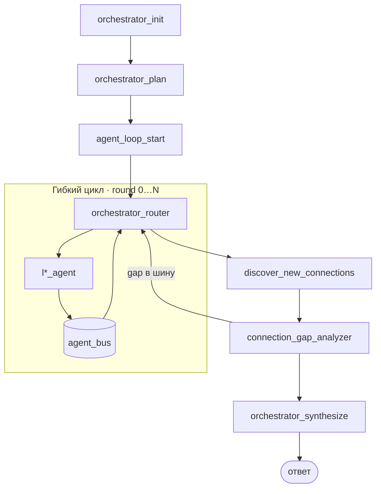

# Оркестратор L1–L6

Режим **`orchestrator_mode`** — LangGraph-граф с **гибким циклом** межслойных агентов,
**JSON-шиной** (`agent_bus`) и финальным синтезом.

> Спецификации layer agents — в разделе **Межслойные агенты (L1–L6)**. Здесь — узлы оркестратора и маршрутизация.

UI cache: `?v=95` (при странном поведении — **Ctrl+F5**).

## Поток LangGraph



Код: `services/agents/app/orchestrator_graph.py` · шина: `agent_bus.py` · агенты: `layer_nodes.py`.

## Узлы оркестратора

| Узел | Назначение |
|------|------------|
| `orchestrator_init` | Документы, пустой граф, инициализация `agent_bus` |
| `orchestrator_plan` | LLM: `planned_layers`, `priority_layers`, `query_facets` |
| `agent_loop_start` | `round=0`, `max_rounds=AGENT_LOOP_MAX_ROUNDS` |
| `orchestrator_router` | Выбор следующего `l*_agent` или `discover` |
| `discover_new_connections` | Cross-layer пути Neo4j |
| `connection_gap_analyzer` | Пробелы → `gap_found` в шину или synthesize |
| `orchestrator_synthesize` | Финальный structured ответ |

## Конфигурация

```env
AGENT_LOOP_MAX_ROUNDS=4
```

## API и чат

```http
POST /api/v1/agents-service/run/async
{
  "query": "…",
  "mode": "orchestrator_mode",
  "user_role": "analyst"
}
```

Poll: `GET /api/v1/agents-service/run/{run_id}` — `trace`, `graph`, `layer_results` обновляются до `status=complete`.

В UI чата «Подробный» режим использует async run + live graph panel.

Trace: `orchestrator_router` с `next_agent`, `round`, `bus_messages`; шаги агентов с `situation_evaluation`.

## Связанные разделы

- **Межслойные агенты (L1–L6)** — схема шины, алгоритм цикла
- **Чат, роли и AI-агенты** — UI trace, fallback, fast mode
