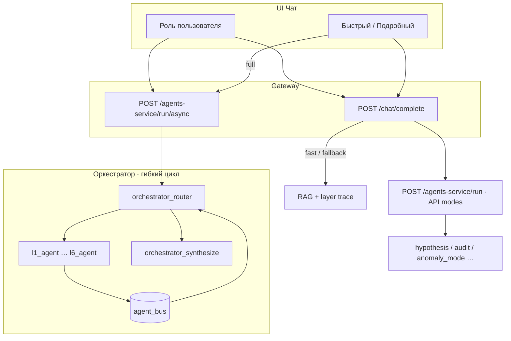

# Роли vs агенты

В MKG **роли пользователя**, **межслойные агенты L1–L6** и **AI-режимы (API)** — три разные оси.
Роли задают права и системный промпт; межслойные агенты — оценку задачи по слою знаний;
AI-режимы — выбор LangGraph-графа **только через API** (в UI чата их нет).

> Подробно о межслойных агентах: раздел **Межслойные агенты (L1–L6)**.

UI cache: `?v=95` (при странном поведении — **Ctrl+F5**).

## Схема

> `anomaly_mode` — **внутренний AI-режим**, не роль. Роль для аномалий — `anomaly_hunter`.

## Роли пользователя (8)

| ID | Название | `can_run_agents` | Связанный agent_id |
|----|----------|------------------|-------------------|
| `admin` | Администратор | ✅ | security |
| `researcher` | Исследователь | ✅ | synthesis |
| `engineer` | Инженер данных | ❌ | ingestion |
| `analyst` | Аналитик | ✅ | retrieval |
| `validator` | Валидатор | ✅ | validation |
| `security` | Безопасность | ❌ | security |
| `anomaly_hunter` | Охотник за аномалиями | ✅ | retrieval |
| `viewer` | Наблюдатель | ❌ | notification |

**Роль** влияет на системный промпт, права upload/extraction и badge в чате.

## Скорость vs AI-режим

| UI | `speed_mode` | Путь |
|----|--------------|------|
| **Быстрый** | `fast` | `/chat/complete` — Qdrant L3+L4, без оркестратора |
| **Подробный** + `can_run_agents` | `full` | `/run/async` оркестратор + poll graph |
| **Подробный** без агентов | `full` | `/chat/complete` RAG-fallback |

AI-режимы (`audit_mode`, `hypothesis_mode`, …) — `POST /query` или `/agents-service/run`, **не pill в UI**.

## Когда что использовать

| Задача | Роль | UI |
|--------|------|-----|
| Быстрый вопрос по корпусу | analyst | Быстрый |
| Полный обход слоёв + trace | researcher | Подробный |
| Загрузка и пайплайн | engineer | — (без агента) |
| Аномалии L4 (API) | anomaly_hunter | `POST /query` mode=anomaly_mode |

Источник ролей: `services/gateway/app/roles.py`  
Источник агентов: `orchestrator_graph.py`, `layer_nodes.py`, `agent_bus.py`

## Безопасность MVP

localhost без server auth; роль — клиентский выбор. Production требует auth middleware.
