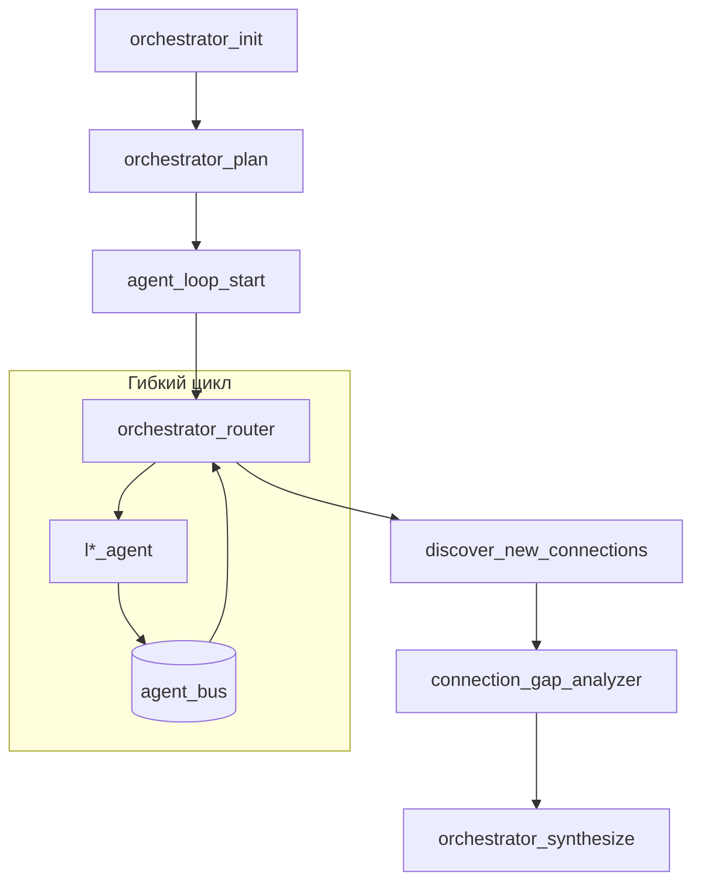

# Межслойные агенты (L1–L6)

> **Межслойный агент** — узел LangGraph по одному онтологическому слою. **Не** роль пользователя и **не** AI-режим в UI.

UI cache: `?v=95` (при странном поведении — **Ctrl+F5**).

## Гибкий цикл агентов (шина JSON)

Оркестратор **не** выполняет жёсткий L1→L6. Раунды до `AGENT_LOOP_MAX_ROUNDS` (default 4).



### JSON-шина

Код: `agent_bus.py`. Типы: `request_evidence`, `gap_found`, `evidence`, `graph_expand`, …

### Маршрутизация

1. Pending bus → target agent
2. Невызванные `planned_layers` (гибкий порядок)
3. Конец раунда → discover → gap → synthesize

## Layer agents

| Агент | Слой | Источники |
|-------|------|-----------|
| l1_agent | L1 | Neo4j materials/processes |
| l2_agent | L2 | Neo4j context |
| l3_agent | L3 | Qdrant chunks |
| l4_agent | L4 | Qdrant claims, HDBSCAN |
| l5_agent | L5 | Neo4j verification |
| l6_agent | L6 | Neo4j TEP |

```env
AGENT_LOOP_MAX_ROUNDS=4
```

Полная версия: `Docs/24_layer_agents.md`.
