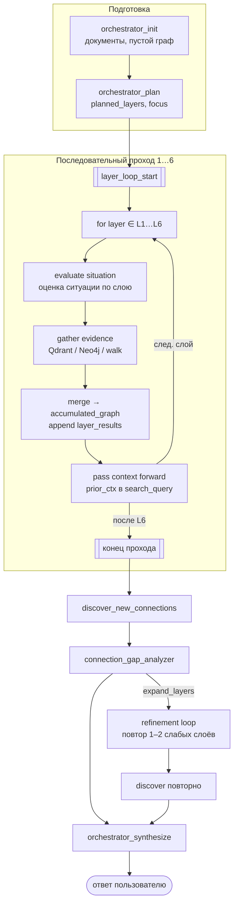
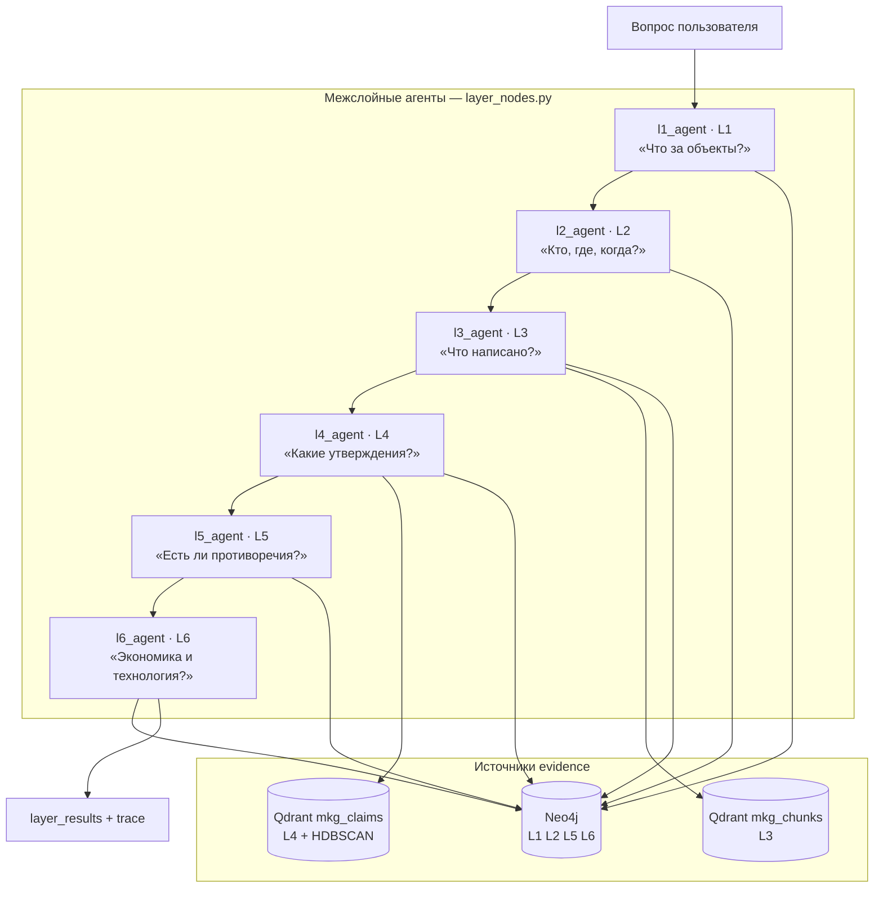
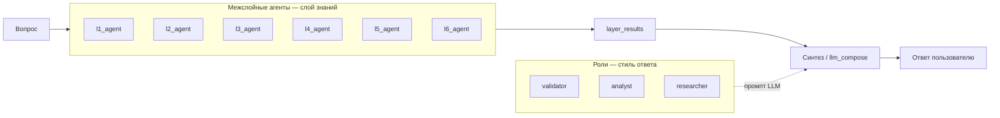
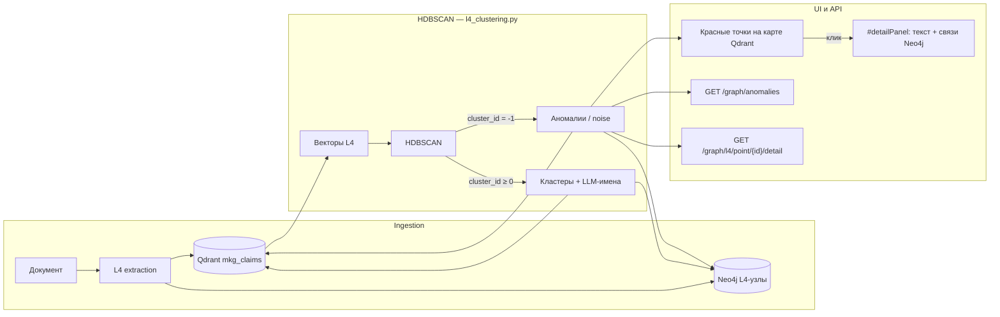
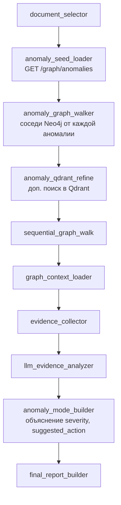

# Межслойные агенты (L1–L6)

> **Межслойный агент** — узел LangGraph, который оценивает вопрос пользователя **с точки зрения одного онтологического слоя** MKG (L1–L6). Это **не** роль пользователя (Валидатор, Аналитик и т.д.) и **не** отдельный AI-режим в UI.

UI cache: `?v=79` (при странном поведении — **Ctrl+F5**).

## Цикл межслойных агентов (L1→L6)

Оркестратор не «вызывает шесть функций подряд» — он выполняет **цикл накопления контекста**: каждый следующий слой получает на вход всё, что нашли предыдущие.



### Два вида цикла (не путать)

| Вид | Когда | Что происходит | Trace-метка |
|-----|-------|----------------|-------------|
| **Последовательный проход** | Всегда после `orchestrator_plan` | L1 → L2 → … → L6, контекст накапливается | `loop_phase: sequential_pass`, `loop_index: 1…6` |
| **Цикл уточнения (refinement)** | Только если gap analyzer нашёл пробелы | Повторный `run_layer_agent` для 1–2 слоёв из `expand_layers`, затем discover снова | `loop_phase: refinement` на повторных шагах |

Последовательный проход — **основной pipeline**. Refinement — **опциональный обратный ход** к слабым слоям, не полный второй круг L1–L6.

### Одна итерация цикла (шаг N из 6)

На каждом шаге `lN_agent` (N = 1…6):

| | Содержание |
|--|------------|
| **Вход** | `query`, `candidate_doc_ids`, `planned_layers`, `layer_results[]` от L1…L(N−1), `accumulated_graph` |
| **Действие агента** | 1) Оценка: «что уже известно с предыдущих слоёв?» (`prior_ctx` в поисковом запросе). 2) Сбор evidence: Qdrant (L3/L4), keyword Neo4j, graph walk. 3) Фильтр по меткам слоя. |
| **Выход** | Запись в `layer_results`, merge узлов/рёбер в `accumulated_graph`, trace: `situation_evaluation`, `agent_question`, `loop_index`, `node_count` |
| **Передача дальше** | Следующий `l(N+1)_agent` видит расширенный `accumulated_graph` и reasoning предыдущих слоёв |

Пример потока reasoning:

1. **L1** — «Какие материалы и процессы?» → узлы Material/Process → *«найдено 4 узла, процесс X»*
2. **L2** — видит L1 → «Кто и где упоминается?» → Document/Expert → *«3 узла, автор Y»*
3. **L3** — видит L1+L2 → «Какие цитаты?» → Qdrant chunks → *«5 параграфов»*
4. **L4** — «Какие claims и аномалии?» → Qdrant claims + HDBSCAN
5. **L5** — «Верификация и противоречия?» → VerificationStatus
6. **L6** — «ТЭП и технологии?» → TechnologySolution, EconomicIndicator

После L6: **discover** ищет cross-layer пути → **gap analyzer** решает, нужен ли refinement → **synthesize** собирает финальный ответ.

### Где виден цикл

| Место | Что показывается |
|-------|------------------|
| Trace оркестратора | `layer_loop_start` → `l1_agent` … `l6_agent` с `loop_index` |
| UI чата «Агенты по слоям L1–L6» | Нумерованная лента **① L1 → ② L2 → … → ⑥ L6** + детали по каждому шагу |
| Режим «Диалог» (fallback) | Облегчённый цикл: те же 6 шагов, `loop_phase: dialog_trace`, без отдельного поиска на слой |

Код: `orchestrator_graph.py` (рёбра L1→L6), `layer_nodes.py` (`run_layer_agent`, `prior_ctx`), `chat_engine.py` (`_append_layer_situation_trace`).

## Три оси системы (не смешивать)

| Ось | Что задаёт | Примеры | Где в коде |
|-----|------------|---------|------------|
| **Межслойные агенты L1–L6** | *Какой слой знаний* анализировать | `l3_agent` ищет TextParagraph в Qdrant | `layer_nodes.py` |
| **Роль пользователя** | *Стиль ответа* и права доступа | Валидатор → акцент на проверку фактов | `roles.py`, системный промпт |
| **AI-режим (LangGraph)** | *Какой граф* обработки запустить | Оркестратор, Аудит, Аномалии | `graph.py`, `orchestrator_graph.py` |

**Ключевое правило:** роль `analyst` **не заменяет** `l4_agent`. Роль меняет тон финального ответа; межслойный агент — источник evidence из конкретного слоя графа.

## Иерархия межслойных агентов

Один и тот же вопрос пользователя последовательно интерпретируется шестью агентами — каждый смотрит на задачу **со своего уровня абстракции**.



Полноценные LangGraph-узлы `l1_agent` … `l6_agent` запускаются **только** в режиме **Оркестратор** (`orchestrator_mode`).
Как оркестратор их вызывает — см. раздел **Оркестратор L1–L6**.

## Межслойные агенты — по одному на слой

Вопросы и reasoning заданы в `_LAYER_AGENT_QUESTIONS` и `_LAYER_REASONING` (`layer_nodes.py`; в диалоге дублируются в `chat_engine.py` для layer trace).

| Агент | Слой | Вопрос агента | Источники данных | Trace-поля |
|-------|------|---------------|------------------|------------|
| `l1_agent` | **L1** | Какие материалы, процессы и оборудование связаны с запросом? | Neo4j: Material, Process, Equipment… | `agent_question`, `situation_evaluation`, `node_count` |
| `l2_agent` | **L2** | Кто и где упоминается в контексте документов? | Neo4j: Document, Expert, Organization, Location… | то же |
| `l3_agent` | **L3** | Какие текстовые фрагменты релевантны вопросу? | Qdrant `mkg_chunks`, TextParagraph, graph walk | то же |
| `l4_agent` | **L4** | Какие факты, утверждения и аномалии связаны с темой? | Qdrant `mkg_claims`, HDBSCAN cluster mates, `/graph/anomalies` | то же |
| `l5_agent` | **L5** | Как классифицированы и верифицированы найденные данные? | VerificationStatus, Contradiction, AuditTrail | то же |
| `l6_agent` | **L6** | Какие технологические и экономические показатели затронуты? | TechnologySolution, EconomicIndicator… | то же |

### Алгоритм одного layer agent (`run_layer_agent`)

1. Проверка: слой в `planned_layers` (иначе `skipped: true` в trace).
2. Поиск: Qdrant для L3/L4; keyword + фильтр меток Neo4j для всех слоёв.
3. Graph walk: `walk_for_chat` — расширение контекста (до 2 hops).
4. Merge в `accumulated_graph` + запись `reasoning_step` и `situation_evaluation` в trace.

### Метки Neo4j по слоям

| Слой | Основные метки |
|------|----------------|
| L1 | Material, Process, Equipment, ChemicalReagent, StandardMetric, PhaseState, Property |
| L2 | Document, Expert, Location, Organization, Event, Timeline, Facility |
| L3 | TextParagraph, TableMatrix, HeadingContext, LangContext, SynonymMap |
| L4 | Claim, Measurement, ExperimentRun, TechStage, Formula, Effect, Deviation… |
| L5 | VerificationStatus, SecurityRole, Contradiction, AuditTrail, KnowledgeGap |
| L6 | TechnologySolution, EconomicIndicator, EnvironmentalIndicator |

## Роли vs межслойные агенты

| | **Роль пользователя** | **Межслойный агент L1–L6** |
|--|----------------------|----------------------------|
| **Задаёт** | Стиль и права ответа | Слой knowledge graph для evidence |
| **Пример** | `validator` → «проверь факты» | `l5_agent` → узлы VerificationStatus |
| **В UI** | Выпадающий список «Роль» | Trace «Агенты по слоям» / шаги `l*_agent` |
| **Количество** | 8 ролей | 6 агентов (по числу слоёв) |



## Где layer agents запускаются

| Контекст | Полноценные агенты? | Код |
|----------|---------------------|-----|
| **Оркестратор** (`orchestrator_mode`) | ✅ последовательный **цикл** L1→L6 с накоплением контекста | `orchestrator_graph.py` → `run_layer_agent` |
| **Диалог** (`mode = null`) | ⚠️ облегчённый layer trace | `_append_layer_situation_trace()` в `chat_engine.py` |
| Другие AI-режимы | ❌ свои графы без L1–L6 | `graph.py` |

### Режим «Диалог» — RAG без полного оркестратора

В режиме **Диалог** LangGraph **не** запускается. Gateway выполняет:

1. `chat_role` — роль → системный промпт
2. `qdrant_search` — dual search L3+L4
3. `graph_traversal` — обход Neo4j
4. **Layer trace** — шаги `l1_agent` … `l6_agent` с `situation_evaluation` по уже найденным узлам (без отдельного поиска на каждом слое)
5. `llm_compose` — ответ YandexGPT

Это **облегчённая** оценка для UI «Агенты по слоям»: те же имена шагов, но не полноценные агенты из `layer_nodes.py`.

## L4-аномалии: HDBSCAN и `anomaly_mode`

### Как HDBSCAN помечает аномалии

После индексации L4-узлов (Claim, Measurement, ExperimentRun…) в Qdrant-коллекцию **`mkg_claims`** gateway или worker запускает глобальную кластеризацию (`mkg_core.l4_clustering`):

1. Загружаются **все L4-эмбеддинги** из Qdrant.
2. Алгоритм **`hdbscan.HDBSCAN`** ищет плотные группы похожих фактов.
3. Каждой точке присваивается **`cluster_id`**:
   - `≥ 0` — точка в кластере (имя и описание генерирует LLM);
   - **`-1`** — **noise / outlier**: семантически не похожа ни на одну плотную группу.
4. Метки записываются в три места:
   - payload Qdrant (`cluster_id`, `is_anomaly`, `anomaly_score`, `cluster_name`);
   - свойства узлов JSON-графа и Neo4j;
   - API `GET /graph/anomalies` — список выбросов.

Параметры: `HDBSCAN_MIN_CLUSTER_SIZE`, `HDBSCAN_MIN_SAMPLES` в `.env`. Режим **`answers_only`** пропускает L4 и HDBSCAN.



### Где используется `anomaly_mode` (LangGraph)

**`anomaly_mode`** — внутренний AI-режим в `services/agents/app/graph.py`. Он **не** отображается как pill в UI чата (убран из селектора режимов). Запуск — только через API:

```http
POST /api/v1/agents-service/run
{ "query": "…", "mode": "anomaly_mode", "doc_ids": ["doc:…"] }
```

Цепочка узлов LangGraph при `mode = anomaly_mode`:



| Узел | Что делает |
|------|------------|
| `anomaly_seed_loader` | Загружает L4-выбросы через `GET /graph/anomalies`; при отсутствии меток — триггерит `POST /graph/l4/cluster` |
| `anomaly_graph_walker` | Обход графа от каждого `node_id`-аномалии: входящие/исходящие связи |
| `anomaly_qdrant_refine` | Уточняющий semantic search по тексту аномалий |
| `anomaly_mode_builder` | LLM формирует `anomalies[]`: `explanation`, `severity`, `related_neighbors`, `suggested_action` |

**Роль `anomaly_hunter`** (8 пользовательских ролей) — отдельная ось: стиль промпта «охотник за аномалиями», не заменяет `anomaly_mode`.

### Как чат и оркестратор используют аномалии

| Контекст | Механизм | Где видно |
|----------|----------|-----------|
| **Оркестратор** (`orchestrator_mode`) | `l4_agent` ищет claims в Qdrant + может подтянуть `/graph/anomalies` | Trace «Агенты по слоям» → шаг L4 |
| **Диалог** (без LangGraph) | Dual search L3+L4; layer trace помечает L4-узлы с `cluster_id=-1` | Ответ чата + источники |
| **`anomaly_mode`** (API) | Полный граф аномалий с объяснениями | JSON-ответ agents-service |
| **Карта Qdrant** | PCA 2D, красные точки = `cluster_id=-1` | Вкладка Qdrant → клик → `#detailPanel` |
| **API деталей** | `GET /graph/l4/point/{node_id}/detail` | Текст, `anomaly_reason`, ближайший кластер, рёбра Neo4j |

Код: `packages/core/src/mkg_core/l4_clustering.py`, `services/gateway/app/graph_anomalies.py`, `services/agents/app/nodes.py` (`anomaly_*`), `services/gateway/app/static/js/app.js` (`openQdrantPointDetail`).

## `anomaly_mode` — внутренний режим, не роль

| | ID | Тип | Назначение |
|--|-----|-----|------------|
| **Роль** | `anomaly_hunter` | Пользовательская роль (8 ролей) | Права + промпт «охотник за аномалиями» |
| **AI-режим** | `anomaly_mode` | LangGraph-граф (внутренний, **не pill в UI**) | Обход L4-выбросов HDBSCAN + Neo4j + Qdrant |

`anomaly_mode` **не** является ролью и **не** выбирается в выпадающем списке режимов чата. Типичная пара для API: роль `anomaly_hunter` + `"mode": "anomaly_mode"`.

## API (запуск через оркестратор)

```http
POST /api/v1/agents-service/run
{
  "query": "Какие материалы связаны с экспериментами?",
  "mode": "orchestrator_mode",
  "doc_ids": ["doc:abc123"],
  "user_role": "researcher"
}
```

Trace layer agents: `l1_agent` … `l6_agent` с полями `agent_question`, `situation_evaluation`, `reasoning`.

## Связанные разделы

- **Оркестратор L1–L6** — LangGraph-поток: init → plan → **цикл L1…L6** → discover → gap → synthesize
- **Иерархия агентов** — сводная таблица всех измерений
- **Чат, роли и AI-агенты** — режимы, upload, trace в UI
- **Пайплайн и слои L1–L6** — ingestion и онтология слоёв
