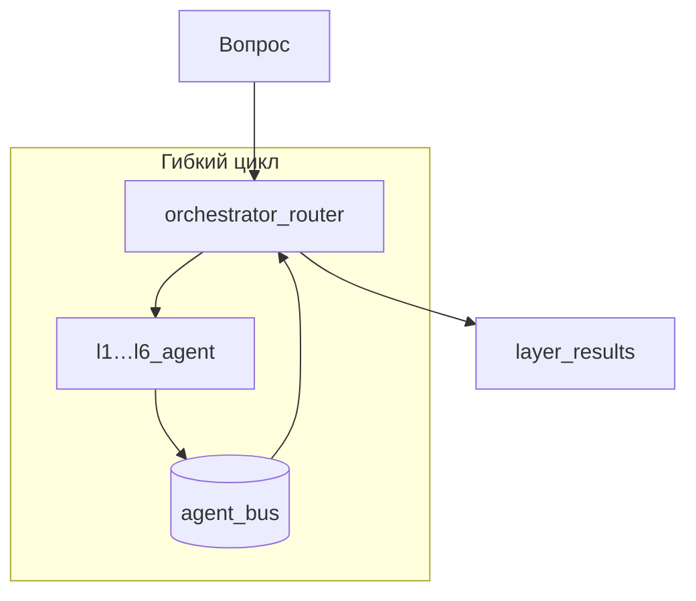

# Иерархия агентов MKG

> **Межслойные агенты L1–L6** — каноническое описание в **Межслойные агенты (L1–L6)**: гибкий цикл, JSON-шина, отличие от ролей.

UI cache: `?v=95` (при странном поведении — **Ctrl+F5**).

## Три оси: слой, роль, скорость

| Измерение | Что задаёт | Пример |
|-----------|------------|--------|
| **Слой (L1–L6)** | *Откуда* evidence | L4 → Claim, аномалии |
| **Роль** | *Как* ответ (стиль, права) | Валидатор → проверка |
| **Скорость** | Быстрый RAG / Подробный оркестратор | `fast` / `full` |
| **AI-режим (API)** | LangGraph-граф | Аудит, Гипотезы |

Порядок layer agents **не фиксирован L1→L6** — маршрутизатор + JSON-шина (`AGENT_LOOP_MAX_ROUNDS`, default 4).



## Оркестратор

| Узел | Назначение |
|------|------------|
| `orchestrator_init` | Документы, `agent_bus` |
| `orchestrator_plan` | `planned_layers`, `query_facets` |
| `agent_loop_start` | round=0 |
| `orchestrator_router` | Следующий `l*_agent` |
| `discover_new_connections` | Cross-layer пути |
| `connection_gap_analyzer` | `gap_found` → шина или synthesize |
| `orchestrator_synthesize` | Structured ответ |

## Чат: как складывается

```mermaid
flowchart LR
  Q[Вопрос] --> S{speed_mode}
  R[Роль] --> S
  S -->|fast| FAST[/chat/complete]
  S -->|full + agents| ASYNC[/run/async + poll]
  S -->|full без agents| RAG[/chat/complete RAG]
```

## Безопасность MVP

localhost без server auth; роль — клиентский выбор. Production требует auth middleware.
