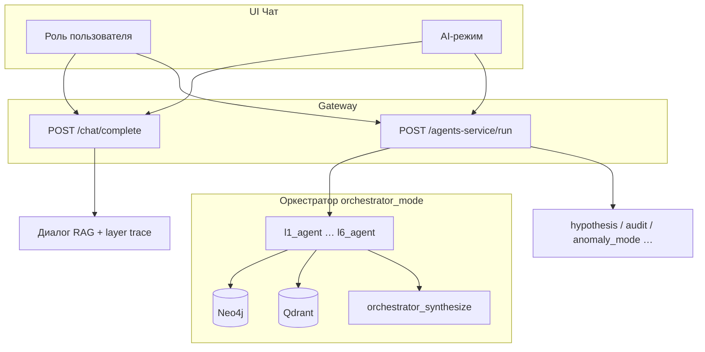

# Роли vs агенты

В MKG **роли пользователя**, **межслойные агенты L1–L6** и **AI-режимы** — три разные оси.
Роли задают права и системный промпт; межслойные агенты — оценку задачи по слою знаний;
AI-режимы — выбор LangGraph-графа.

> Подробно о межслойных агентах: раздел **Межслойные агенты (L1–L6)**.

## Схема

> `anomaly_mode` — **внутренний AI-режим**, не роль. Роль для аномалий — `anomaly_hunter`.

## Роли пользователя (8)

| ID | Название | `can_run_agents` | Связанный agent_id |
|----|----------|------------------|-------------------|
| `admin` | Администратор | ✅ | security |
| `researcher` | Исследователь | ✅ | synthesis |
| `engineer` | Инженер данных | ❌ | ingestion |
| `analyst` | Аналитик | ✅ | retrieval |
| `validator` | Валидатор | ✅ | validation |
| `security` | Безопасность | ❌ | security |
| `anomaly_hunter` | Охотник за аномалиями | ✅ | retrieval |
| `viewer` | Наблюдатель | ❌ | notification |

**Роль** влияет на:
- системный промпт (`GET/PUT /api/v1/roles/{id}/prompt`);
- права upload / extraction / запуск агентов;
- отображение badge в чате.

## AI-режимы (LangGraph)

| Mode ID | UI | Назначение |
|---------|-----|------------|
| *(null)* | **Диалог** | Dual Qdrant L3+L4 → graph walk → LLM |
| `orchestrator_mode` | Оркестратор | L1–L6 layer agents последовательно |
| `hypothesis_mode` | Гипотезы | Гипотезы и связи между фактами |
| `audit_mode` | Аудит | Противоречия, issue/severity |
| `anomaly_mode` | Аномалии | L4-выбросы HDBSCAN + Neo4j |
| `literature_review_mode` | Обзор | Структурированный обзор |
| `recommendation_mode` | Советы | Рекомендации по теме |

## Диалог vs агент

### Диалог (`mode = null`)

Trace: `chat_role` → `qdrant_l3` → `qdrant_l4_cluster` → `graph_traversal` → `llm_compose`.

Не использует LangGraph; быстрый RAG через `chat_engine.py`.

### Agent modes

Trace: `capabilities_check` → `llm_scope_planner` → `document_selector` →
`retrieval_search` → … → `final_report_builder`.

**orchestrator_mode** — отдельный граф с `l1_agent` … `l6_agent`.

## Когда что выбирать

| Задача | Роль | Режим |
|--------|------|-------|
| Быстрый вопрос по документам | analyst | Диалог |
| Поиск аномалий L4 | anomaly_hunter | anomaly_mode |
| Полный обход всех слоёв | researcher | orchestrator_mode |
| Загрузка и пайплайн | engineer | — (без агента) |

Источник ролей: `services/gateway/app/roles.py`  
Источник агентов: `services/agents/app/graph.py`, `orchestrator_graph.py`  
Иерархия layer agents и углы L1–L6: раздел **Межслойные агенты (L1–L6)** в документации приложения.
